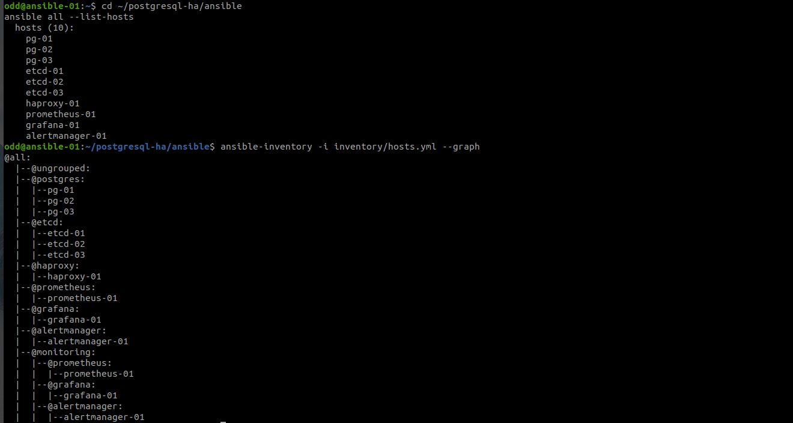
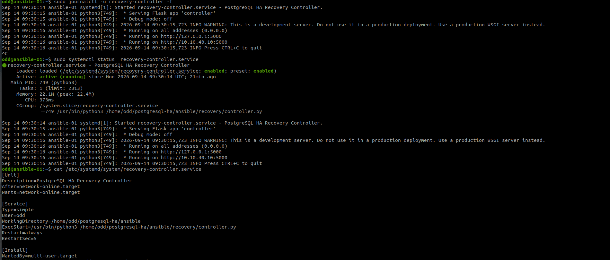
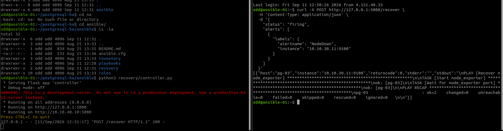

# Тема дипломного проекта: Построение самовосстанавливающегося  отказоустойчивого кластера PostgreSQL на базе Patroni/etcd в Yandex Cloud с мониторингом, автоматическим восстановлением и оповещением об инцидентах

### Ход действий:
Для начала я описала архитектуру будущего дипломного проекта. Для отказоустойчивости, но при этом не сильных финансовых затратах было выбрано :

    Три хоста с postgresql: pg-01, pg-02, pg-03
    Три хостя etcd-нодами: etcd-01, etcd-02, etcd-03
    Один HAProxy: haproxy-01
    Один Prometheus: prometheus-01
    Одна Grafana: grafana-01
    Один Alertmanager: alertmanager-01
    И один управляющий Ansible-хост: ansible-01

Итого вышло 11 виртуальных машин. 
Так как ранее я не часто работала в Yandex Cloud то для прокачки скиллов выбран был именно он.
При это учтено правило доступности с учетом availability zone. Те. PostgreSQL-ноды и etcd были распределены по разным availability zones, чтобы отказ одной зоны не выводил из строя весь кластер.

После чего описала создание нашей  инфраструктуру в Yandex Cloud через Terraform
Для этого описала:

1) Виртуальные машины [compute.tf](postgresql-ha-terraform/compute.tf)
2) Подсети [network.tf](postgresql-ha-terraform/network.tf)
3) Зоны доступности, Дополнительные необходимые сетевые параметры. [variables.tf](postgresql-ha-terraform/variables.tf)
4) Security groups [security-groups.tf](postgresql-ha-terraform/security-groups.tf)
5) Cетевые интерфейсы 
6) Public static IP для ansible-01 [static-ip.tf](postgresql-ha-terraform/static-ip.tf)
7) Telegram workflow для яндекса [telegram-workflow.tf](postgresql-ha-terraform/telegram-workflow.tf)

Таким образом инфраструктура стала воспроизводимой через подход IaC. 

В рамках терраформ защитила инфраструктуру от случайного удаления.

На этапе Terraform столкнулись с проблемой: семейство Ubuntu обновилось в образам самого Yandex, изменился image_id, и Terraform начал предлагать пересоздание виртуальных машин.

Для этого добавила в [compute.tf](postgresql-ha-terraform/compute.tf)

    lifecycle {
      prevent_destroy = true
    
      ignore_changes = [
        boot_disk[0].initialize_params[0].image_id
      ]
    }

Это позволило избежать ошибки,с которой столкнулась в момент проверки те не удалять существующие машины, игнорировать автоматическое изменение ID образа,безопаснее выполнять terraform plan.

После чего начала работу с Ansible
В inventory описала группы:

Рисунок 1 - Устройство групп ansible

Настроила SSH-доступ с ansible-01 к управляемым машинах класстера и мониторинга. В ходе тестирования это оказалось важным и для recovery-controller так как systemd-сервис не видел SSH-ключ из интерактивной пользовательской сессии. Поэтому SSH-ключ явно привязала к Ansible inventory.  Это так же позволило запускать Ansible не только вручную, но и автоматически из Python-контроллера.

Развернула etcd-кластер из роли ансибл путем установки на трех узлах установили etcd [etcd.yml](ansible/playbooks/etcd.yml) :
Развернула PostgreSQL + Patroni

На трех PostgreSQL-серверах  из роли ансибл [patroni.yml](ansible/playbooks/patroni.yml) путем установки на трех узлах установила postgre + partoni + python зависимости 

Получился кластер: 

    pg-01   Leader
    pg-02   Sync Standby
    pg-03   Replica

Перепроверила streaming replication,те изменения с Leader автоматически передаются на реплики.
На всякий случай перепроверила автоматический failover Patroni. Patroni под капотом использует etcd для определения Leader. При недоступности текущего Leader другая подходящая PostgreSQL-нода может быть автоматически promoted. Это обеспечивает отказоустойчивость базы данных без ручного переключения. По сути решение из коробки, но для уверенности перепроверила.

Развернула HAProxy с помощь роли ансибл [haproxy.yml](ansible/playbooks/haproxy.yml).

HAProxy используется как единая точка подключения к PostgreSQL. Он проверяет Patroni API и понимает, какая нода в данный момент является Leader.  Таким образом приложение может подключаться к HAProxy, не зная заранее, какая PostgreSQL-нода сейчас Primary.

На виртумальных машинах серверах установили node_exporter на стандартом порту 9100.
На машинах с patroni подняла дополнительно  postgres_exporter

Развернула Prometheus +  grafana + alertmanager так же через готовую роль мониторинг стека prometheus stack [monitoring.yml](ansible/playbooks/monitoring.yml)

Добавила кастомные alert rules. Таким образом Prometheus отвечает не только за сбор метрик, но и за обнаружение аварий.

Настроила Telegram-уведомления. Создала бот черещ boofatrher и завязала его на свой alertmanager.

Изначально пыталась  отправлять уведомления напрямую через api.telegram.org, но в ходе тестов обнаружила сетевую проблему. Yandex VM → Telegram API соединение зависало по timeout, при этом остальная сеть была доступна.
Поэтому после ресерча в инете + общение с gpt создала Yandex Workflow через который и будут ходить оповещения. Подправила alertmanager. 

После чего перешла к самомому сложному этапу настройки. Нужно было сделать не просто уведомление и ручное участие, а автоматическое восстановление.

Добавила собственный сервис Recovery Controller на машинку ansible-01. Контроллер написан на Python + Flask [controller.py](controller.py) и описала сервис systemd для автоматического рестарта в случае выключения главноего хоста ansible.

Русок 2 - Сервис с recovery для автовосстановления 

Recovery-controller принимает webhook POST /recover от Alertmanager.
Он парсит status,alertname,и название самой машины.
Контроллер определяет, какой Ansible-хост соответствует alert vm, через соповставление имени с private ip, например, 10.10.30.11:9100 это pg-03

В Python коде контроллера добавила allowlist:

RECOVERY_RULES = {
    "NodeDown": "recovery-node-exporter.yml",
    "PostgreSQLDown": "recovery-postgres.yml",
    "PatroniDown": "recovery-patroni.yml",
    "EtcdDown": "recovery-etcd.yml",
    "HAProxyDown": "recovery-haproxy.yml",
}

Создала Ansible recovery плэйбуки
Например:
для NodeDown создан [recovery-node-exporter.yml](ansible/playbooks/recovery-node-exporter.yml)
Здесь запускается node_exporter, включается его автозапуск экспортера,а после ждёт открытия порта 9100.

Рисунок 3 -  отработка сервиса recovery

Так же созданы следующие плэйбуки для автовосстановления haproxy [recovery-haproxy.yml](ansible/playbooks/recovery-haproxy.yml) ,etcd [recovery-etcd.yml](ansible/playbooks/recovery-etcd.yml) а также для восстновления самого patroni [recovery-patroni.yml](ansible/playbooks/recovery-patroni.yml)

### Важно! 
Автовосстановления патрони до конца не оттедабжено (закончились лимиты на yandex грантах) . Сначала определяется роль ноды, чтоб не делать бездубным рестарт ноды. 

## Вывод о пределанной работе:
В рамках дипломного проекта был реализован отказоустойчивый кластер PostgreSQL на базе Patroni и etcd в Yandex Cloud. Инфраструктура разворачивается с помощью Terraform, а настройка и восстановление сервисов автоматизированы с использованием Ansible. Для мониторинга используются Prometheus, Grafana и Alertmanager, дополнительно реализован механизм автоматического восстановления при возникновении отказов.

В процессе работы возник ряд проблем. Изменение ID образа Ubuntu приводило к тому, что Terraform планировал пересоздание виртуальных машин — проблема была решена с помощью lifecycle и ignore_changes. Также возникли ограничения сетевого доступа к Telegram API из Yandex Cloud, поэтому отправка уведомлений была реализована через Yandex Workflows. 

Эти ошибки позволили проверить систему не только в штатном режиме, но и в реальных аварийных сценариях. В результате была построена инфраструктура, способная обнаруживать сбои, уведомлять о них и автоматически выполнять восстановительные действия.
