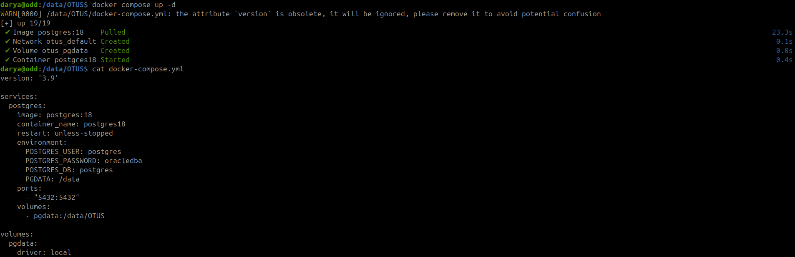
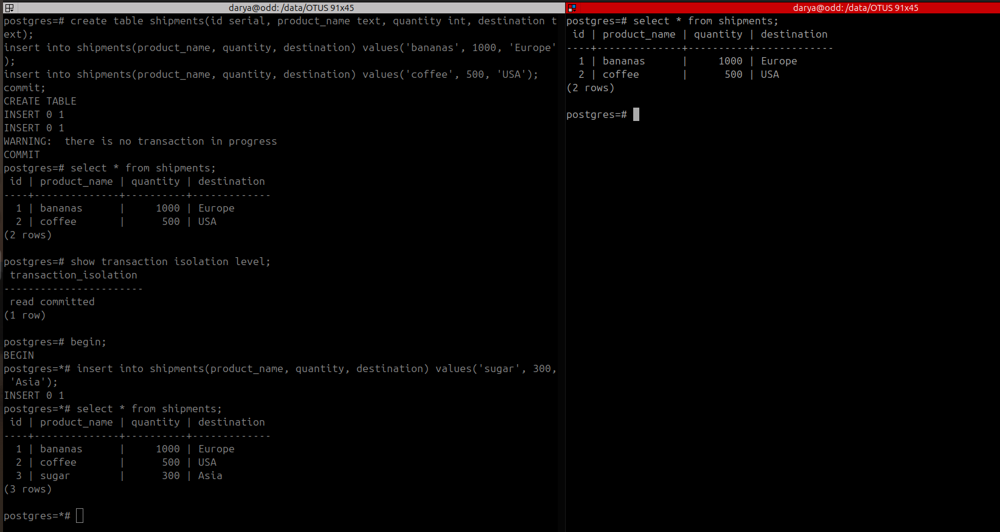
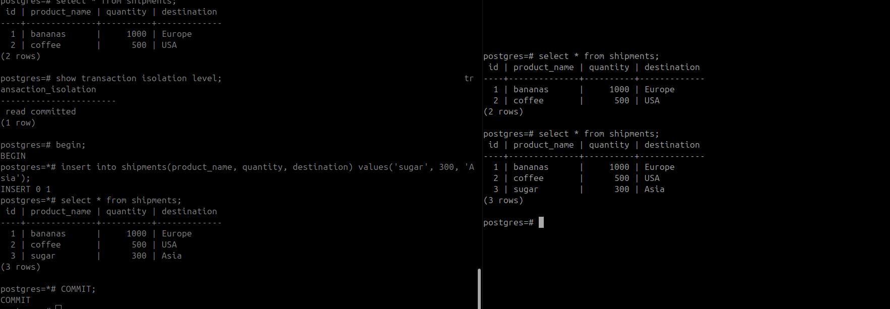
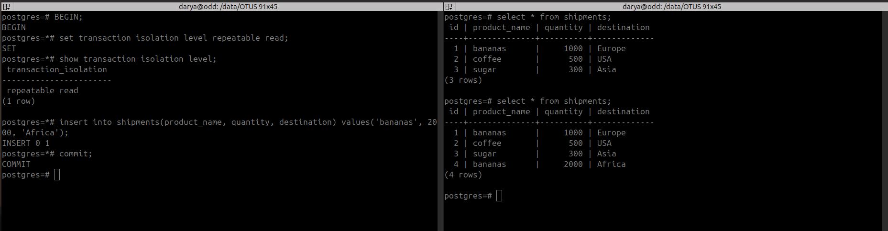

# HW 1 - Работа с уровнями изоляции транзакции в PostgreSQL

## Задание 1-3

### Ход действий:
Подняла docker контейнер c PostgreSQL 18 на локальном пк. Пробросила отдельным volume для сохранности  данных после перезапуска контейнера. 

            Рисунок 1 – Docker compose up с postgresql 18

## Задание 4-6
### Ход действий:
Подключилась к postgresql под одним и тем же пользователем, но в двух разных сессиях.
В первой сессии создала таблицу, добавила две записи, при использовании режима read committed.
После чего провела эксперемент  и добавила в открытой транзакции BEGIN  новую (третья) запись. До того как не произошел явный коммит в рамках транзакции третья запись не отображалась во второй сессии.

  Рисунок 2 – Изоляция уровня  read committed

Рисунок  3 – Явное завершение транзакции из первой сессии.

### Вывод:
Каждое отдельное SQL-выражение видит только закоммиченные данные на момент начала этого запроса.
Т.е. вторая транзакция увидела только закомиченную строку. строго после явного commit.

## Задание 7
### Ход действий:
В рамках первой сессии открыла транзакцию, изменила режим уровня изоляции на set repeatable read после чего сделала добавление еще одной записи из первой сесси. В рамках первой сессии запись сразу же отобразилась, но пользователь второй сессии ее не увидел до проведения явного коммита. Как только был проведен коммит , новая запись со значением values('bananas', 2000, 'Africa') отобразилась и на второй сессии.

Рисунок 4 -  Режим repeatable read

### Вывод:
PostgreSQL всегда показывает изменения внутри одной транзакции, но не показывает незавершенную транзацию в рамках другой сессии. 
Те исправленный Isolation level не ограничивает от собственных изменений в рамках транзакции, но ограничивает видимость чужих изменений