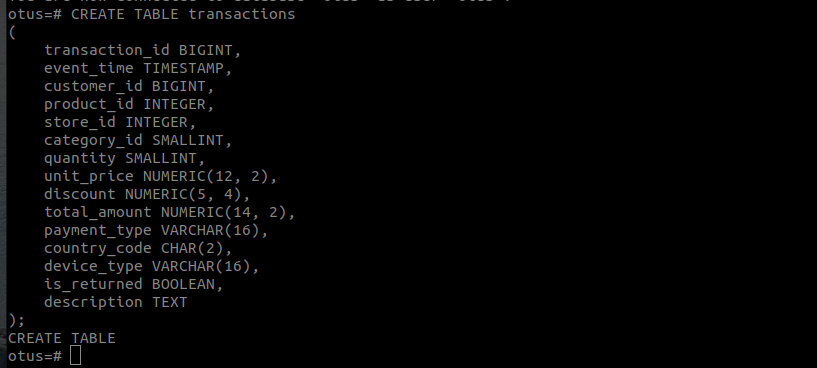
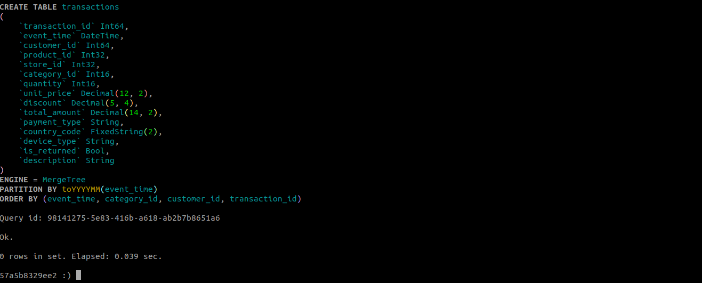
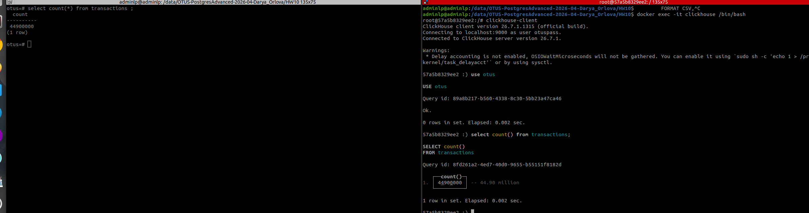
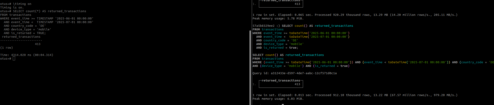
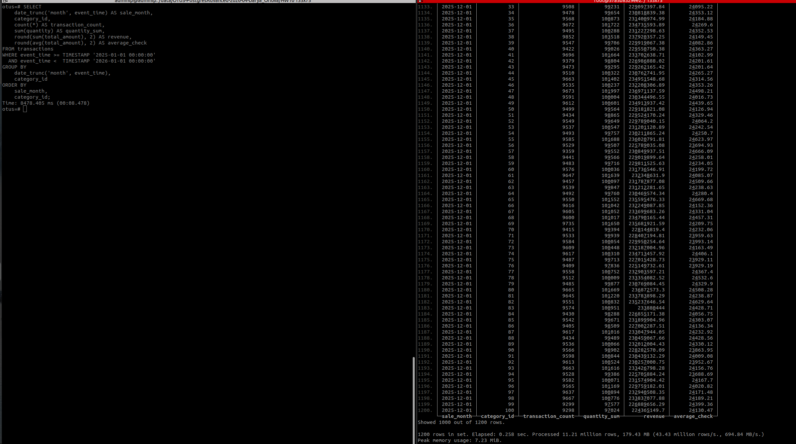

# HW 10 - Работа с большими данными в PostgreSQLPostgreSQL и VKcloud
## Задание:Выбрать одну из СУБД это может быть ClickHouse, Greenplum, MongoDB, MySQL, Tarantool — что угодно, что установишь и сможешь сравнить с PostgreSQL. Загрузить в неё данные. Объём данных: от 10 до 100 Гб . Протестировать механизмы загрузки: COPY, INSERT, стриминг, параллельную загрузку, сторонние утилиты. Провести сравнение. Написать 2–3 запроса: с фильтрацией, агрегацией и соединением. Сравнить скорость выполнения на PostgreSQL и выбранной системе. Зафиксировать: план выполнения, время, объём данных, системные условия.

### Ход действий:
Для сравнения был выбран Clickhouse и PostgreSQL.
Два сервиса были подняты локально в докере.
Настройку переменных, органичение ресорсов, задала в [docker-compose.yml](docker-compose.yml)
Каждому сервису было выделено 8 RAM и 4 CPU.
После чего подняла контейнеры в фоновом режиме при помощи команды 

        docker compose up -d 

Подключилась к postgresql и создала две таблицы transactions и products.
Таблица transactions имеет следующую структуру

Рисунок 1 - создание таблицы transactions в postgresql

Для выполнения пункта задачи с запросами на агрегации и соединение создала таблицу products и нагенерировала встроенными средствами postgresql данные.

    CREATE TABLE products
    (
        product_id   INTEGER PRIMARY KEY,
        product_name VARCHAR(64) NOT NULL,
        brand_id     INTEGER NOT NULL,
        supplier_id  INTEGER NOT NULL,
        base_price   NUMERIC(12, 2) NOT NULL
    );
    
    INSERT INTO products
    SELECT
        product_id,
        'Product ' || product_id,
        ((product_id - 1) % 5000) + 1,
        ((product_id - 1) % 1000) + 1,
        round((10 + (product_id % 100000) / 100.0)::numeric, 2)
    FROM generate_series(1, 2000000) AS product_id;

Так же подключилась к clickhouse и создала такие же таблицы с типами данных подходящих для clickhouse. Без партиционирования или отдельных ключей. Дабы сравнение имело одинаковые условия.

Рисунок 2 - создание таблицы transactions в clickhouse
Аналогично и для clickhouse для выполнения пункта задачи с запросами на агрегации и соединение создала таблицу products и нагенерировала встроенными средствами clickhouse данные.

    CREATE TABLE products
    (
        product_id UInt32,
        product_name String,
        brand_id UInt32,
        supplier_id UInt32,
        base_price Decimal(12, 2)
    )
    ENGINE = MergeTree
    ORDER BY product_id;
    
    INSERT INTO products
    SELECT
        number + 1 AS product_id,
        concat('Product ', toString(number + 1)),
        ((number % 5000) + 1) AS brand_id,
        ((number % 1000) + 1) AS supplier_id,
        toDecimal64(
            10 + ((number + 1) % 100000) / 100.0,
            2
        ) AS base_price
    FROM numbers(2000000);

Для вставки данных использовала transactions.csv, который ранее был выгружен из clickhouse на тестовых стендах работы.
Для заливки данных в postgres использовала следующую команду COPY:

     docker exec -i postgres   psql -U otus -d otus 
      -c "
        COPY transactions
        (
            transaction_id,
            event_time,
            customer_id,
            product_id,
            store_id,
            category_id,
            quantity,
            unit_price,
            discount,
            total_amount,
            payment_type,
            country_code,
            device_type,
            is_returned,
            description
        )
        FROM STDIN
        WITH
        (
            FORMAT CSV,
            HEADER TRUE,
            ENCODING 'UTF8'
        );
      " < /data/transactions.csv
  Количество влитых строк:  COPY 44900000

Для заливки данных в clickhouse  использовала следующую команду INSERT INTO format . Так как clickhouse спокойно умеет читать данные из csv и по особенностям своей работы вставляет не построчно, а пачками. Что является для него предпочтительнее :

    docker exec -i clickhouse clickhouse-client --user otuspass  --password otuspass --database otus  --async_insert=0   --max_insert_block_size=1000000 \
      --query="
        INSERT INTO transactions
        (
            transaction_id,
            event_time,
            customer_id,
            product_id,
            store_id,
            category_id,
            quantity,
            unit_price,
            discount,
            total_amount,
            payment_type,
            country_code,
            device_type,
            is_returned,
            description
        )
        FORMAT CSVWithNames
      " < /data/transactions.csv

После чего удостоверилась, что количество данных вставленных из csv файла совпадает в обоих сервисах.

Рисунок 3 - Сравнение количества строк postgres и clickhouse

Дальше без создания дополнительных индексов в двух сервисах приступила к сравнению быстрых отработки запроса SELECT в clickhouse и postgres, c заданным условием where.
Clickhouse выполнил данный запрос за 0,013 sec в то время как postgresql на это понадобилось более 4 секунд.

В качестве аналитичного select запроса был выбран:

Рисунок 4 - Сравнение времени отработки SELECT запроса в двух сервисах

После чего выполнила агрегированный запрос с ORDER BY в двух сервисах и опять clickhouse оказался быстрее. Clickhouse затратил 0,258 секунды, а postgresql более 8 секунд.

Рисунок 5 - Сравнение качества отработки при одинаковых условиях агрегированного запроса

## Вывод: В ходе тестирования были сравнены PostgreSQL и ClickHouse на одинаковом наборе системных значений и количества данных. ClickHouse показал преимущество в аналитических запросах благодаря колоночному хранению, сжатию, параллельному выполнению и возможности исключать части данных на основании первичного ключа. В то время как PostgreSQL обрабатывает строки построчно и при отсутствии подходящих индексов выполнял последовательное сканирование всей таблицы. Как и ожидалось Clickhouse для запросов показал себя лучше,но лишь потому что он оптимизирован для аналитических чтений и агрегаций больших объёмов данных,в то время  как PostgreSQL имеет примущуество  развитую транзакционность, ограничения целостности, обновление отдельных записей и универсальные механизмы индексации. ПОэтому выбор сирвиса  должен определяться  только на основании характера и качества последующей нагрузки.