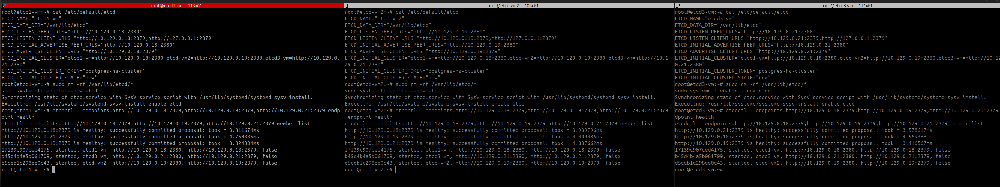
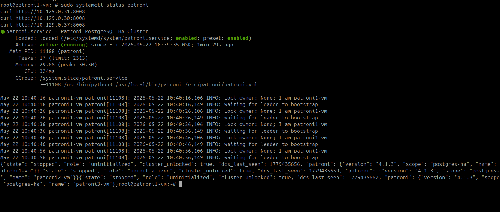
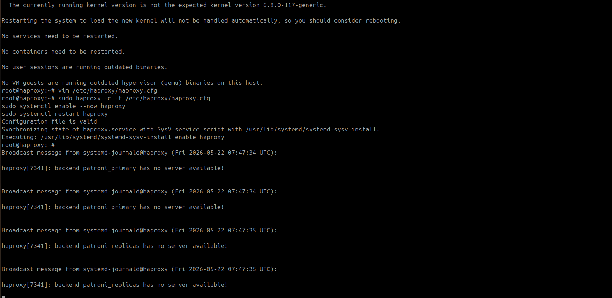

# HW 11 - Работа с кластером высокой доступности 
## Задание: HA-кластер в облаке. Разверните кластер PostgreSQL с высокой доступностью с использованием одного из облаков. Patroni + Etcd + HAProxy

### Ход действий:
Так как ранее в рамках обучения мы проходили изучение построение кластера патрони, и это то чему я хотела научиться в рамках обучения, я выбрала вариант построение отказойстойчивого кластера Patroni + Etcd + HAProxy с учетом best practise в Yandex Cloud.
Развернула три etcd машины

      etcd1-vm: 10.129.0.18
      etcd2-vm: 10.129.0.19
      etcd3-vm: 10.129.0.21

Выполнила общие настройки для всех машин etcd:

      sudo apt install -y etcd-server etcd-client
      sudo systemctl stop etcd

После чего внесла на трех серверах etcd обновила  файл /etc/default/etcd
Для etcd-1 конфиг выглядит следующим образом:

    cat /etc/default/etcd 

    ETCD_NAME="etcd1-vm"
    ETCD_DATA_DIR="/var/lib/etcd"
    ETCD_LISTEN_PEER_URLS="http://10.129.0.18:2380"
    ETCD_LISTEN_CLIENT_URLS="http://10.129.0.18:2379,http://127.0.0.1:2379"
    ETCD_INITIAL_ADVERTISE_PEER_URLS="http://10.129.0.18:2380"
    ETCD_ADVERTISE_CLIENT_URLS="http://10.129.0.18:2379"
    ETCD_INITIAL_CLUSTER="etcd1-vm=http://10.129.0.18:2380,etcd-vm2=http://10.129.0.19:2380,etcd3-vm=http://10.129.0.21:2380"
    ETCD_INITIAL_CLUSTER_TOKEN="postgres-ha-cluster"
    ETCD_INITIAL_CLUSTER_STATE="new"

Для etcd-2 конфиг выглядит следующим образом:

    cat /etc/default/etcd 
    ETCD_NAME="etcd-vm2"
    ETCD_DATA_DIR="/var/lib/etcd"
    ETCD_LISTEN_PEER_URLS="http://10.129.0.19:2380"
    ETCD_LISTEN_CLIENT_URLS="http://10.129.0.19:2379,http://127.0.0.1:2379"
    ETCD_INITIAL_ADVERTISE_PEER_URLS="http://10.129.0.19:2380"
    ETCD_ADVERTISE_CLIENT_URLS="http://10.129.0.19:2379"
    ETCD_INITIAL_CLUSTER="etcd1-vm=http://10.129.0.18:2380,etcd-vm2=http://10.129.0.19:2380,etcd3-vm=http://10.129.0.21:2380"
    ETCD_INITIAL_CLUSTER_TOKEN="postgres-ha-cluster"
    ETCD_INITIAL_CLUSTER_STATE="new"

Для etcd-3 конфиг выглядит следующим образом:

    cat /etc/default/etcd 
    ETCD_NAME="etcd3-vm"
    ETCD_DATA_DIR="/var/lib/etcd"
    ETCD_LISTEN_PEER_URLS="http://10.129.0.21:2380"
    ETCD_LISTEN_CLIENT_URLS="http://10.129.0.21:2379,http://127.0.0.1:2379"
    ETCD_INITIAL_ADVERTISE_PEER_URLS="http://10.129.0.21:2380"
    ETCD_ADVERTISE_CLIENT_URLS="http://10.129.0.21:2379"
    ETCD_INITIAL_CLUSTER="etcd1-vm=http://10.129.0.18:2380,etcd-vm2=http://10.129.0.19:2380,etcd3-vm=http://10.129.0.21:2380"
    ETCD_INITIAL_CLUSTER_TOKEN="postgres-ha-cluster"
    ETCD_INITIAL_CLUSTER_STATE="new"

После внесения на всех машинках сделала следующее:

    sudo rm -rf /var/lib/etcd/*
    sudo systemctl enable --now etcd
    sudo systemctl start etcd

И проверила, что etcd законнектинились между собой следующими командами:

    etcdctl --endpoints=http://10.129.0.18:2379,http://10.129.0.19:2379,http://10.129.0.21:2379 endpoint health
    etcdctl --endpoints=http://10.129.0.18:2379,http://10.129.0.19:2379,http://10.129.0.21:2379 member list

Рисунок 1 - Проверка коррекности работы etcd

После чего приступила к настройке патрони сервисов для это на трех машинах 
    
    10.129.0.31 patroni1-vm
    10.129.0.30 patroni2-vm
    10.129.0.37 patroni3-vm

 Установила postgre + patroni и настроила директории следюущими командами:

        sudo apt install -y postgresql postgresql-contrib python3-pip python3-venv python3-dev libpq-dev
        sudo systemctl stop postgresql
        sudo systemctl disable postgresql
        sudo pip3 install --break-system-packages patroni[etcd3] psycopg2-binary
        sudo mkdir -p /etc/patroni /var/lib/postgresql/18/main
        sudo chown -R postgres:postgres /var/lib/postgresql /etc/patroni
        sudo chmod 700 /var/lib/postgresql/18/main

На каждой машине с патрони конфиг /etc/patroni/patroni.yml выглядит следующим образом:

    sudo cat /etc/patroni/patroni.yml
    scope: postgres-ha
    namespace: /service/
    name: patroni1-vm
    
    restapi:
      listen: 10.129.0.31:8008
      connect_address: 10.129.0.31:8008
    
    etcd3:
      hosts: 10.129.0.18:2379,10.129.0.19:2379,10.129.0.21:2379
    
    bootstrap:
      dcs:
        ttl: 30
        loop_wait: 10
        retry_timeout: 10
        maximum_lag_on_failover: 1048576
        postgresql:
          use_pg_rewind: true
          use_slots: true
          parameters:
            wal_level: replica
            hot_standby: "on"
            wal_keep_size: 512MB
            max_wal_senders: 10
            max_replication_slots: 10
    
      initdb:
        - encoding: UTF8
        - data-checksums
    
      pg_hba:
        - host replication replicator 10.129.0.0/24 md5
        - host all all 10.129.0.0/24 md5
        - host all all 127.0.0.1/32 md5
    
      users:
        admin:
          password: adminpass
          options:
            - createrole
            - createdb
    
    postgresql:
      listen: 10.129.0.31:5432
      connect_address: 10.129.0.31:5432
      data_dir: /var/lib/postgresql/16/main
      bin_dir: /usr/lib/postgresql/16/bin
      authentication:
        replication:
          username: replicator
          password: alf84dsjnv23rxcv
        superuser:
          username: postgres
          password: alf84dsjnv23rxcv
      parameters:
        unix_socket_directories: /var/run/postgresql
    
    tags:
      nofailover: false
      noloadbalance: false
      clonefrom: false

Для patroni2 конфиг выглядит следующим образом:

    sudo cat /etc/patroni/patroni.yml
    scope: postgres-ha
    namespace: /service/
    name: patroni2-vm
    
    restapi:
      listen: 10.129.0.30:8008
      connect_address: 10.129.0.30:8008
    
    etcd3:
      hosts: 10.129.0.18:2379,10.129.0.19:2379,10.129.0.21:2379
    
    bootstrap:
      dcs:
        ttl: 30
        loop_wait: 10
        retry_timeout: 10
        maximum_lag_on_failover: 1048576
        postgresql:
          use_pg_rewind: true
          use_slots: true
          parameters:
            wal_level: replica
            hot_standby: "on"
            wal_keep_size: 512MB
            max_wal_senders: 10
            max_replication_slots: 10
    
      initdb:
        - encoding: UTF8
        - data-checksums
    
      pg_hba:
        - host replication replicator 10.129.0.0/24 md5
        - host all all 10.129.0.0/24 md5
        - host all all 127.0.0.1/32 md5
    
      users:
        admin:
          password: adminpass
          options:
            - createrole
            - createdb
    
    postgresql:
      listen: 10.129.0.30:5432
      connect_address: 10.129.0.30:5432
      data_dir: /var/lib/postgresql/16/main
      bin_dir: /usr/lib/postgresql/16/bin
      authentication:
        replication:
          username: replicator
          password: alf84dsjnv23rxcv
        superuser:
          username: postgres
          password: alf84dsjnv23rxcv
      parameters:
        unix_socket_directories: /var/run/postgresql
    
    tags:
      nofailover: false
      noloadbalance: false
      clonefrom: false

Для patroni3 конфиг выглядит следующим образом:

    sudo cat /etc/patroni/patroni.yml
    scope: postgres-ha
    namespace: /service/
    name: patroni3-vm
    
    
    restapi:
      listen: 10.129.0.37:8008
      connect_address: 10.129.0.37:8008
    
    etcd3:
      hosts: 10.129.0.18:2379,10.129.0.19:2379,10.129.0.21:2379
    
    bootstrap:
      dcs:
        ttl: 30
        loop_wait: 10
        retry_timeout: 10
        maximum_lag_on_failover: 1048576
        postgresql:
          use_pg_rewind: true
          use_slots: true
          parameters:
            wal_level: replica
            hot_standby: "on"
            wal_keep_size: 512MB
            max_wal_senders: 10
            max_replication_slots: 10
    
      initdb:
        - encoding: UTF8
        - data-checksums
    
      pg_hba:
        - host replication replicator 10.129.0.0/24 md5
        - host all all 10.129.0.0/24 md5
        - host all all 127.0.0.1/32 md5
    
      users:
        admin:
          password: adminpass
          options:
            - createrole
            - createdb
    
    postgresql:
      listen: 10.129.0.37:5432
      connect_address: 10.129.0.37:5432
      data_dir: /var/lib/postgresql/16/main
      bin_dir: /usr/lib/postgresql/16/bin
      authentication:
        replication:
          username: replicator
          password: alf84dsjnv23rxcv
        superuser:
          username: postgres
          password: alf84dsjnv23rxcv
      parameters:
        unix_socket_directories: /var/run/postgresql
    
    tags:
      nofailover: false
      noloadbalance: false
      clonefrom: false

На всех машинках патрони добавила автозапуск службы с патрони

      cat /etc/systemd/system/patroni.service

    [Unit]
    Description=Patroni Cluster
    After=network.target
    
    [Service]
    Type=simple
    User=postgres
    Group=postgres
    ExecStart=/usr/local/bin/patroni /etc/patroni/patroni.yml
    Restart=always
    RestartSec=30
    
    [Install]
    WantedBy=multi-user.target

Запустила сервис и проверила работопособность кластера на базе Patroni

        sudo systemctl daemon-reload
        sudo systemctl enable --now patroni
        sudo systemctl status patroni
        curl http://10.129.0.31:8008
        curl http://10.129.0.30:8008
        curl http://10.129.0.37:8008

Рисунок 2 - Проверка работоспособности кластера патрони

На отдельно выделенно машине установила компомент haproxy для балансировки между нодами класстера.
И внесла правки в /etc/haproxy/haproxy.cfg

        sudo apt install -y haproxy

        sudo cat /etc/haproxy/haproxy.cfg

        global
            log /dev/log local0
            maxconn 4096
        
        defaults
            log global
            mode tcp
            retries 3
            timeout connect 5s
            timeout client  1m
            timeout server  1m
        
        frontend postgres_write
            bind *:5000
            default_backend patroni_primary
        
        backend patroni_primary
            option httpchk GET /primary
            http-check expect status 200
            default-server inter 3s fall 3 rise 2 on-marked-down shutdown-sessions
            server patroni1 10.129.0.31:5432 check port 8008
            server patroni2 10.129.0.30:5432 check port 8008
            server patroni3 10.129.0.37:5432 check port 8008
        
        frontend postgres_read
            bind *:5001
            default_backend patroni_replicas
        
        backend patroni_replicas
            balance roundrobin
            option httpchk GET /replica
            http-check expect status 200
            server patroni1 10.129.0.31:5432 check port 8008
            server patroni2 10.129.0.30:5432 check port 8008
            server patroni3 10.129.0.37:5432 check port 8008
        
        listen stats
            bind *:7000
            mode http
            stats enable
            stats uri /
            stats refresh 5s

Для проверки работы haproxy выполнил следующие команды:

    sudo haproxy -c -f /etc/haproxy/haproxy.cfg
    sudo systemctl enable --now haproxy
    sudo systemctl restart haproxy

Рисунок 3 - Проверка haproxy

Для проверки  отказоустойчивости кластера, имитировала сбой на одном из хостов.

C машины haproxy подключилась к кластеру пантрони. Создала базу otus и таблицу test.

        postgres=# create database otus;
        CREATE DATABASE
        postgres=# \c otus
        You are now connected to database "otus" as user "postgres".
        
        otus=# CREATE TABLE test(id serial primary key, msg text);
        CREATE TABLE
        otus=# INSERT INTO test(msg) VALUES ('cluster works');
        INSERT 0 1
        otus=# SELECT * FROM test;
         id |      msg      
        ----+---------------
          1 | cluster works
        (1 row)
        
        otus=# SELECT pg_is_in_recovery();
         pg_is_in_recovery 
        -------------------
         f
        (1 row)
        
        otus=# SELECT * FROM test;
         id |      msg      
        ----+---------------
          1 | cluster works
        (1 row)
        
        otus=# exit

    curl -s http://10.129.0.31:8008 | jq
    curl -s http://10.129.0.30:8008 | jq
    curl -s http://10.129.0.37:8008 | jq
    {
      "state": "running",
      "postmaster_start_time": "2026-05-24 16:54:46.901264+03:00",
      "role": "primary",
      "server_version": 160014,
      "xlog": {
        "location": 88288072
      },
      "timeline": 2,
      "replication": [
        {
          "usename": "replicator",
          "application_name": "patroni2-vm",
          "client_addr": "10.129.0.30",
          "state": "streaming",
          "sync_state": "async",
          "sync_priority": 0
        },
        {
          "usename": "replicator",
          "application_name": "patroni3-vm",
          "client_addr": "10.129.0.37",
          "state": "streaming",
          "sync_state": "async",
          "sync_priority": 0
        }
      ],
      "dcs_last_seen": 1779631929,
      "database_system_identifier": "7642621199471090690",
      "patroni": {
        "version": "4.1.3",
        "scope": "postgres-ha",
        "name": "patroni1-vm"
      }
    }
    {
      "state": "running",
      "postmaster_start_time": "2026-05-24 16:54:33.405746+03:00",
      "role": "replica",
      "server_version": 160014,
      "xlog": {
        "received_location": 88288072,
        "replayed_location": 88288072,
        "replayed_timestamp": "2026-05-24 17:11:44.187750+03:00",
        "paused": false
      },
      "timeline": 2,
      "replication_state": "streaming",
      "dcs_last_seen": 1779631929,
      "database_system_identifier": "7642621199471090690",
      "patroni": {
        "version": "4.1.3",
        "scope": "postgres-ha",
        "name": "patroni2-vm"
      }
    }
    {
      "state": "running",
      "postmaster_start_time": "2026-05-24 16:54:32.342178+03:00",
      "role": "replica",
      "server_version": 160014,
      "xlog": {
        "received_location": 88288072,
        "replayed_location": 88288072,
        "replayed_timestamp": "2026-05-24 17:11:44.187750+03:00",
        "paused": false
      },
      "timeline": 2,
      "replication_state": "streaming",
      "dcs_last_seen": 1779631929,
      "database_system_identifier": "7642621199471090690",
      "patroni": {
        "version": "4.1.3",
        "scope": "postgres-ha",
        "name": "patroni3-vm"
      }
    }

После чего выключила первую ноду патрони - которая выступала primary серером.
Внесла INSERT строку.

    psql -h 127.0.0.1 -p 5000 -U postgres -d otus
    Password for user postgres: 
    psql (16.14 (Ubuntu 16.14-0ubuntu0.24.04.1))
    Type "help" for help.
    
    otus=# SELECT pg_is_in_recovery();
    
    INSERT INTO test(msg) VALUES ('after failover');
    
    SELECT * FROM test;
     pg_is_in_recovery 
    -------------------
     f
    (1 row)
    
    INSERT 0 1
     id |      msg       
    ----+----------------
      1 | cluster works
     34 | after failover
    (2 rows)
    
    otus=# exit

Включила обратно первый патрони и убедилась, что он стал репликой и данные корректно отображаются.

        odd@haproxy:~$ curl -s http://10.129.0.31:8008 | jq
        {
          "state": "running",
          "postmaster_start_time": "2026-05-24 17:15:34.466387+03:00",
          "role": "replica",
          "server_version": 160014,
          "xlog": {
            "received_location": 88321608,
            "replayed_location": 88321608,
            "replayed_timestamp": "2026-05-24 17:15:11.809781+03:00",
            "paused": false
          },
          "timeline": 3,
          "replication_state": "streaming",
          "dcs_last_seen": 1779632163,
          "database_system_identifier": "7642621199471090690",
          "patroni": {
            "version": "4.1.3",
            "scope": "postgres-ha",
            "name": "patroni1-vm"
          }
        }

## Вывод о пределанной работе:
Был развернут  кластер PostgreSQL на базе Patroni и etcd из трёх узлов с настройкой HAProxy для автоматического переключения клиентов между primary и replic-ами.
