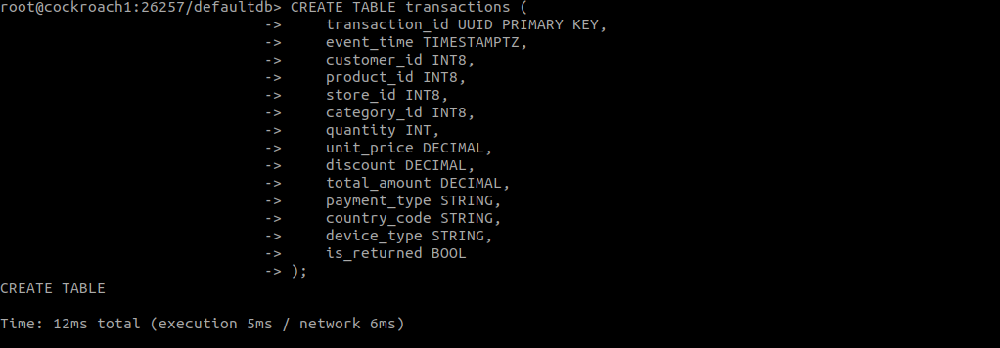
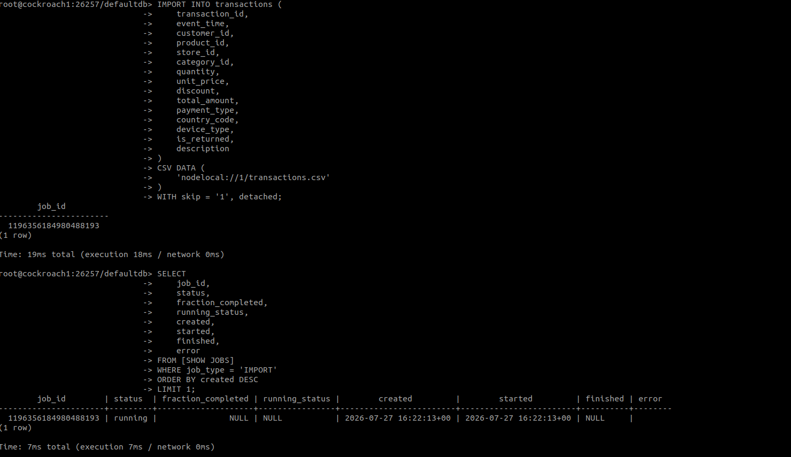
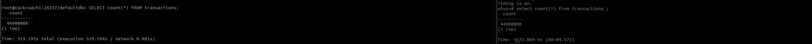

# HW 12 - Работа с горизонтально масштабируемым кластером 
## Задание: Разверни CockroachDB. Сравни производительность запросов с однопользовательским инстансом PostgreSQL

### Ход действий:
Так как репозитории CockroachDB блокируют доступ с русских ip -шников, то было принято решение развернуть три ноды CockroachDB локально в докер контейнерах.
Если бы это был продакшн и мне действительно был бы необходим CockroachDB то я бы подняла его в разных дата регионах,  скачивала бы к себе исходки через VPN и с помощью scp скопировала на виртуальную машину в Яндекс Облако.
Для выполнения домашней работы использовала следующий [docker-compose.yml](docker-compose.yml), где описала отдельные волумы и задала параметры для старта конейнеров.

После того как убедилась, чтио все контейнеры поднялись docker ps запустила инициализацию кластера.

    docker exec cockroach1 cockroach init --insecure --host=cockroach1:26257

И проверила, что класстер готов к работе:

    docker exec cockroach1  cockroach node status  --insecure   --host=cockroach1:26257
    
    id	address	sql_address	build	started_at	updated_at	locality	attrs	is_available	is_live
    1	cockroach1:26257	cockroach1:26257	v25.4.10	2026-07-27 16:31:59.725443 +0000 UTC	2026-07-27 17:02:57.100074 +0000 UTC	region=local,zone=zone-a	[]	true	true
    2	cockroach2:26257	cockroach2:26257	v25.4.10	2026-07-27 15:24:49.146272 +0000 UTC	2026-07-27 17:02:58.153447 +0000 UTC	region=local,zone=zone-b	[]	true	true
    3	cockroach3:26257	cockroach3:26257	v25.4.10	2026-07-27 16:34:33.315274 +0000 UTC	2026-07-27 17:02:58.039733 +0000 UTC	region=local,zone=zone-c	[]	true	true
    
Внутри контейнера создала таблицу transactions

Рисунок 1 - Создание таблицы внутри transactions

Внутрь самого контейнера загрузила transactions.csv размером 11 гб для дальнейшего импорта данных в БД.
После создания таблицы импортировала данные из transactions.csv 

Рисунок 2 - Импортирование данных в CockroachDB таблицу

Заметила сразу, что импорт данных занял больше времени, чем вставка данных в standby PostgreSQL.
Для сравнения использовала рядом стоящий докер контейнер с PostgreSQL поднято в рамках домашней работы №10.

Рисунок 3 - Сравнение select в PostgreSQL и CockroachDB класстером.

## Вывод о пределанной работе:
Исходя из проделанной работы одиночный PostgreSQL сразу показал себя быстрее, так как работает как централизованная СУБД и не тратит ресурсы на координацию между несколькими узлами. 
Все операции записи выполняются локально без необходимости  кворума и репликации в режиме реального времени. Это снижает задержки и уменьшает накладные расходы на обработку транзакций.
Однако CockroachDB имеет очень важное преимущество из коробки, которое заключается не в максимальной производительности одного узла, а в горизонтальном масштабировании и высокой отказоустойчивости. 
Она автоматически реплицирует данные между узлами, продолжает работать при отказе части кластера, позволяет выполнять обновления без простоя и масштабировать систему по нодам достаточно просто