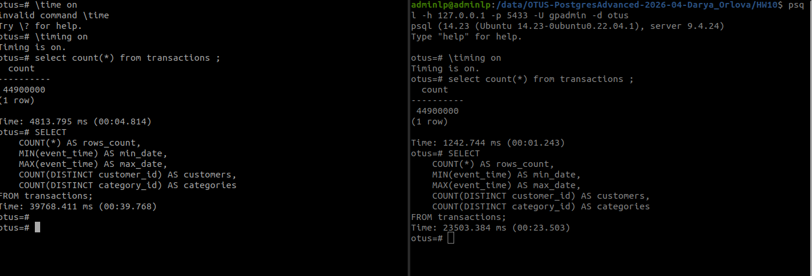
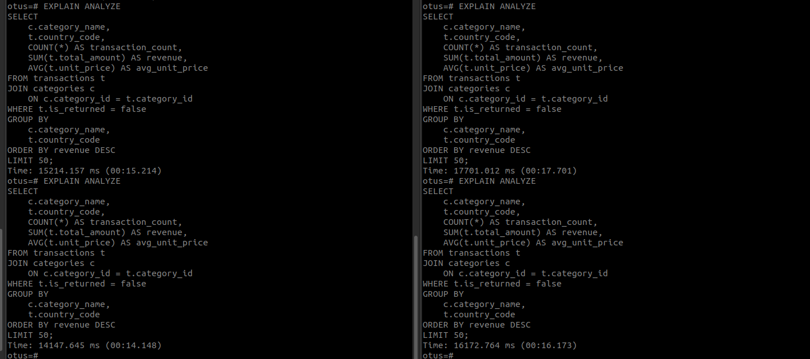

# HW 13 - Массивно параллельные кластера PostgreSQL 
## Задание: Развёрнть один из кластеров: Yugabyte или Greenplum в Kubernetes. Загрузить датасет не менее 10 гб. Провести тестирование (сравнение) с одиночным инстансом PostgreSQL. 

### Ход действий:
Для начала я подняла миникуб на локальном ПК.
После чего написала минимальны манифест кубернетеса для поднятия Greenplum, так как он наиболее интересен на практике.
Перед apply манифеста создала namaspace с именем greenplumotus , чтобы все сервисы касающиеся Greenplum были сгрупированы.

Манифест выглядит следующим образом:
[manifest.yaml](manifest.yaml)
, где для StatefulSet внесены ограничительные лимиты и проброшен volume /data

Для доступа из консоли psql в поду поднятому с помощью манифеста использовала port-forward команду:

    kubectl port-forward -n greenplumotus svc/greenplum 5433:5432

Для загрузки данных в greenplum использовала оператор copy:

    [pg@greenplum-0 ~]$ time psql -d otus   -c "\copy transactions
          FROM '/data/transaction.csv'
          WITH (
            FORMAT csv,
            HEADER true,
            DELIMITER ',',
            QUOTE '\"',
            ESCAPE '\"',
            ENCODING 'UTF8'
          );"
    COPY 44900000

В качестве одиночного стенда PostgreSQL был использован контейнер поднятый в рамках домашней работы номер 10 с загруженным в него аналогичную структуру transactions.csv размером 11 гб.

Для сравнения стендов postgresql и greenplum использовала запросы с фильтрацией по датам (ограничение where), общий count перебор,  и join с автосгенерированной таблицей.
Ниже представлен скриншот выполнения команды select count(*) и select с агрерированием.
За основу для сравнения брала первый запрос (холодный запрос).
Слева на скриншоте postgresql stand only , а справа greenplum.

Рисунок 1 - Результат команды count и агрерированно запроса

Как результат greenplum выполнил запрос с агрегациями за 23 секунды ,а postgresql за 39 секунд.
Count подсчет в greenplum выполнился за 12 секунд, postgresql за 4.8 секунды. 

Для сравнения оперативности выполнения join запроса создала таблицу categories и заполнила ее данными из таблицы transactions:

        otus=# CREATE TABLE categories
        (
            category_id INTEGER,
            category_name TEXT
        )
        DISTRIBUTED BY (category_id);
        CREATE TABLE
        
        SELECT DISTINCT
            category_id,
            'Category ' || category_id::text AS category_name
        FROM transactions;

После чего запустила дважды запустила join запрос с ограничениями 

        SELECT
            c.category_name,
            t.country_code,
            COUNT(*) AS transaction_count,
            SUM(t.total_amount) AS revenue,
            AVG(t.unit_price) AS avg_unit_price
        FROM transactions t
        JOIN categories c
            ON c.category_id = t.category_id
        WHERE t.is_returned = false
        GROUP BY
            c.category_name,
            t.country_code
        ORDER BY revenue DESC
        LIMIT 50;

Рисунок 2 - Результат сравнения join запроса

Проверила сегменты в grenplum и количество таблиц распределенных по сегментам:
    
    otus=# SELECT
        content,
        role,
        preferred_role,
        status,
        hostname,
        port
    FROM gp_segment_configuration
    ORDER BY content, role;
     content | role | preferred_role | status | hostname  | port  
    ---------+------+----------------+--------+-----------+-------
          -1 | p    | p              | u      | localhost |  5432
           0 | p    | p              | u      | localhost | 40000
           1 | p    | p              | u      | localhost | 40001
           2 | p    | p              | u      | localhost | 40002
    (4 rows)
    
    Time: 14.093 ms
    otus=# SELECT
        gp_segment_id,
        COUNT(*) AS rows_count
    FROM transactions
    GROUP BY gp_segment_id
    ORDER BY gp_segment_id;
     gp_segment_id | rows_count 
    ---------------+------------
                 0 |   14967784
                 1 |   14964183
                 2 |   14968033
    (3 rows)

## Вывод о пределанной работе:
PostgreSQL оказался местами медленнее, поскольку выполняет обработку данных на одном стенде .
При объеме данных в 11 гб для отработки запроса выполнялась операция полного сканирования, агрегации и JOIN при том  последовательно. А вот Greenplum распределяет данные и вычисления между несколькими сегментами, что позволяет выполнять аналогичные  запросы параллельно и сокращать время обработки на больших наборах данных.
