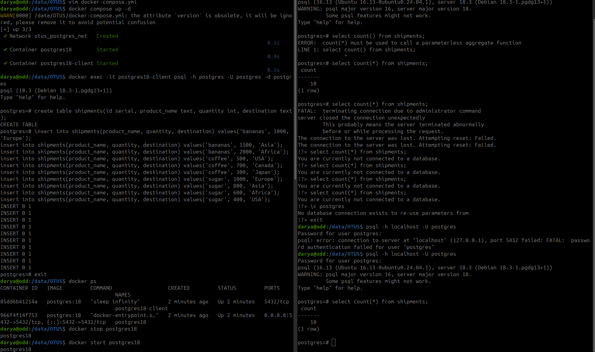

# HW 2 - Установка и настройка PostgteSQL в контейнере Docker
## Задание 1-5
### Ход действий:
В рамках работы с докер контейнером использовала систему docker compose.
В docker-compose.yml описала два контейнера для postgres18 server и postgres18-client.
Для контейнера с сервером подняла отдельный volume который будет хранить данные postgres в директории  /var/lib/postgres.
Контейнер клиента зависит от сервера. Т.е. пока контейнер сервера не будет в состоянии Running. Контейнер клиента не запустится.
Два контейнера работают в общей докер-сети - postgres_vnet. А следовательно у них одинакова подсеть.

    version: '3.9'
    
    services:
      postgres:
        image: postgres:18
        container_name: postgres18
        restart: always
        environment:
          POSTGRES_USER: postgres
          POSTGRES_PASSWORD: testpass
          POSTGRES_DB: postgres
          PGDATA: /var/lib/postgres
        ports:
          - "5432:5432"
        volumes:
          - pgdata:/var/lib/postgres
        networks:
          - postgres_vnet
    
      postgres-client:
        image: postgres:18
        container_name: postgres18-client
        restart: "no"
        depends_on:
          - postgres
        environment:
          PGPASSWORD: testpass
        entrypoint: ["sleep", "infinity"]
        networks:
          - postgres_vnet
    
    volumes:
      pgdata:
        driver: local
    
    networks:
      postgres_vnet:
        driver: bridge

## Задание 6 - 9
### Ход действий:
Выполнила подключение из контейнера postgres-client к контейнеру с сервером postgres.
Для этого выполнила команду:

docker exec -it postgres18-client psql -h postgres -U postgres -d postgres

После чего произвела вставку данных из первой сессии, где подключение идет через контейнер с клиентом.

После чего выполнила подключение из локально установленного клиента psql и проверила, что данные действительно отображаются.

Для проверки действия сохранности данных выполнила команду docker stop postgres18, вследствии чего действительно увидела, что соединение локального клиента было отрошено и данные нельзя было получить.
Как только контейнер был запущен командой docker start postgres18 данные были отображены.

Рисунок 1 - Отображение действий с докер контейнером

### Вывод: 
При использовании докер сервисов, можно получить изолированную сеть для использоваия postgresql и его зависимых объектов в отдельных контейнерах.
В свою очередь использование статичных volume позволяет сохранить закомиченые данные, даже в случае незапланированного рестарта хоста или докер контейнера. 
