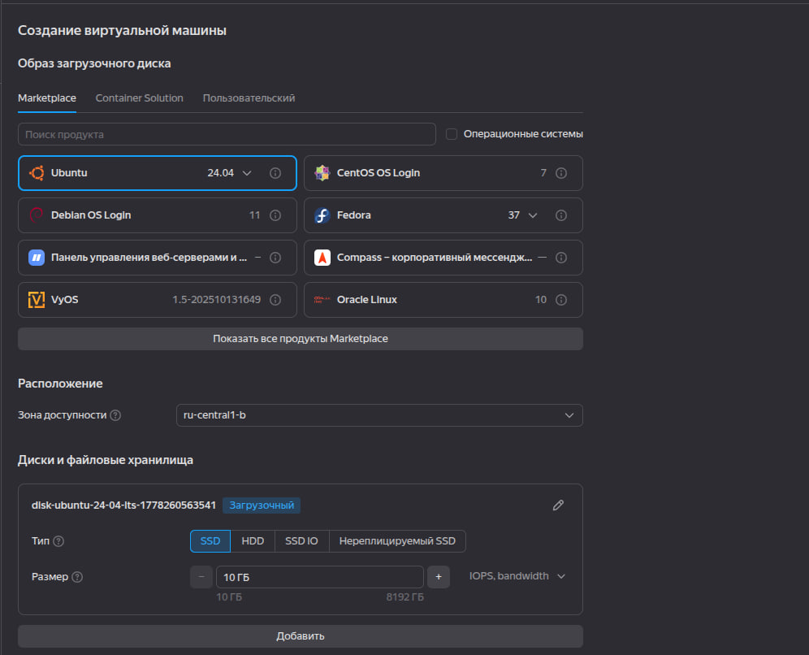
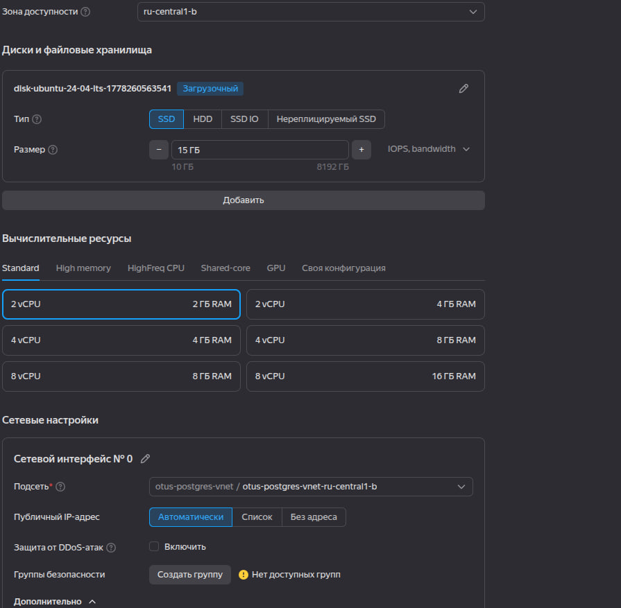
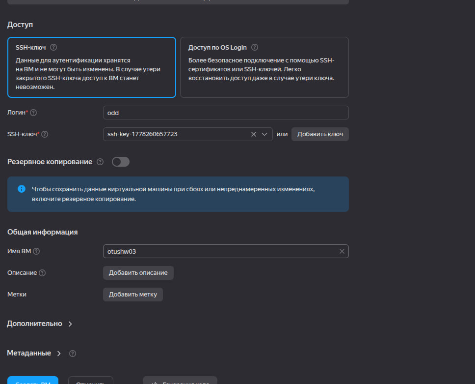
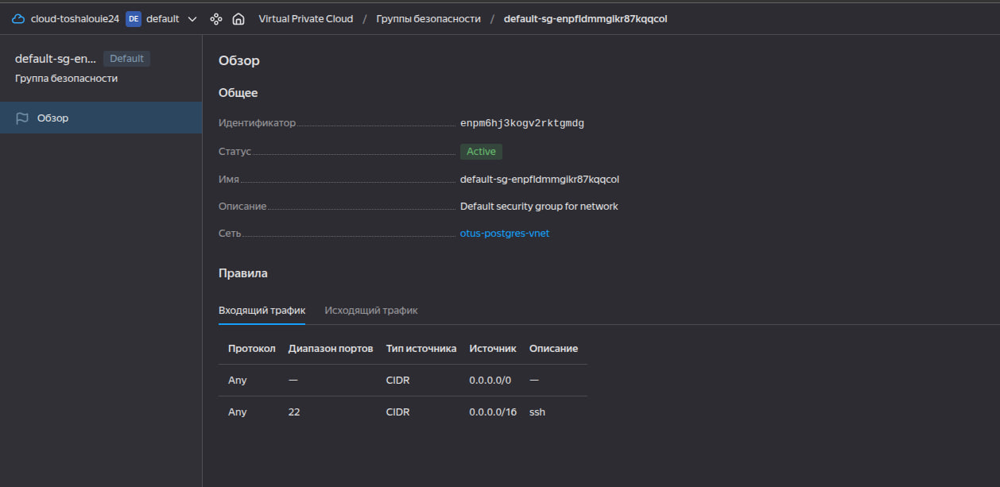
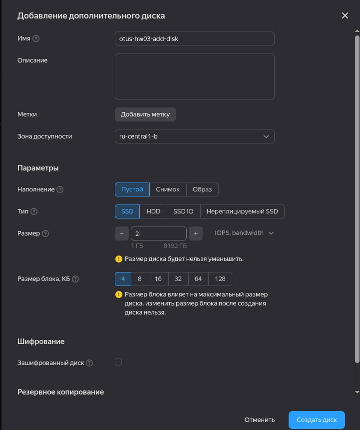
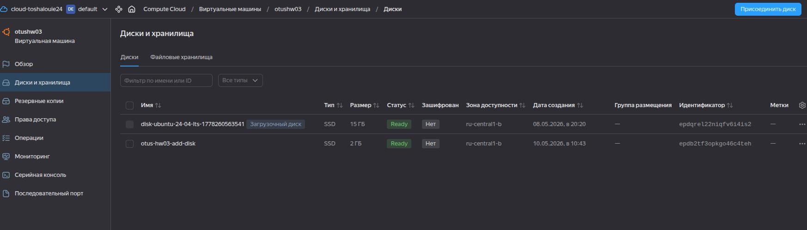

# HW 3 - Спасение данных на внешнем диске
## Задание 1 
### Ход действий:

Развернула VM в Yandex Cloud - otushw03.
В качестве ОС выбрана - Ubuntu 24.04
Оперативный диск на 15 гб
Размер: 2 cpu  и 2 gb Ram

В отдельной сети: otus-postgres-vnet и подсетью: otus-postgres-vnet-ru-central-1b

Public IP выдается автоматически и меняется после каждого рестарта машины.

В качестве network security group создана своя с default-sg-enpfldmmgikr87kqqcol где в качестве эксперимента открыт 22(ssh) порт на вход.

Авторизация пользователя на машине для подключения происходит через ssh-accces-key.

                                    Рисунок 1 - Выбор ОС

                                Рисунок 2 - Настройка сети для новой машины

                            Рисунок 3 - Настройка авторизаиции по приватному ssh ключу

                            Рисунок 4 - Настройка сетевой группы (sg)

После подключения на виртуальную машины ,произвела установку postgre и выполнила настройку для подключения, следующим образом:

    ssh -l odd 89.169.168.212
    sudo apt update && sudo apt upgrade -y -q && sudo sh -c 'echo "deb http://apt.postgresql.org/pub/repos/apt $(lsb_release -cs)-pgdg main" > /etc/apt/sources.list.d/pgdg.list' && wget --quiet -O - https://www.postgresql.org/media/keys/ACCC4CF8.asc | sudo apt-key add - && sudo apt-get update && sudo apt -y install postgresql && sudo apt install unzip && sudo apt -y install mc
    sudo vim /etc/postgresql/18/main/postgresql.conf --внесла правку: listen_addresses = '*'
    sudo vim /etc/postgresql/18/main/pg_hba.conf --внесла правку: host    all             all             0.0.0.0/0               scram-sha-256
    sudo -u postgres psql --задала пароль для подключения
        \password 
    sudo pg_ctlcluster 18 main restart --перезапустила pg

## Задание 2
### Ход действий

Cоздала бд hw03, добавила в нее новую таблицу и наполнила ее данными

    postgres=# CREATE DATABASE hw03;
    CREATE DATABASE
    postgres=# \l
                                                     List of databases
       Name    |  Owner   | Encoding | Locale Provider | Collate |  Ctype  | Locale | ICU Rules |   Access privileges   
    -----------+----------+----------+-----------------+---------+---------+--------+-----------+-----------------------
     hw03      | postgres | UTF8     | libc            | C.UTF-8 | C.UTF-8 |        |           | 
     postgres  | postgres | UTF8     | libc            | C.UTF-8 | C.UTF-8 |        |           | 
     template0 | postgres | UTF8     | libc            | C.UTF-8 | C.UTF-8 |        |           | =c/postgres          +
               |          |          |                 |         |         |        |           | postgres=CTc/postgres
     template1 | postgres | UTF8     | libc            | C.UTF-8 | C.UTF-8 |        |           | =c/postgres          +
               |          |          |                 |         |         |        |           | postgres=CTc/postgres
    (4 rows)
    
    postgres=# \с hw03
    invalid command \с
    Try \? for help.
    postgres=# \c hw03
    You are now connected to database "hw03" as user "postgres".
    hw03=# 
create table shipments(id serial, product_name text, quantity int, destination text);
    CREATE TABLE
    hw03=# insert into shipments(product_name, quantity, destination) values('bananas', 1000, 'Europe');
    insert into shipments(product_name, quantity, destination) values('bananas', 1500, 'Asia');
    insert into shipments(product_name, quantity, destination) values('bananas', 2000, 'Africa');
    insert into shipments(product_name, quantity, destination) values('coffee', 500, 'USA');
    insert into shipments(product_name, quantity, destination) values('coffee', 700, 'Canada');
    insert into shipments(product_name, quantity, destination) values('coffee', 300, 'Japan');
    insert into shipments(product_name, quantity, destination) values('sugar', 1000, 'Europe');
    insert into shipments(product_name, quantity, destination) values('sugar', 800, 'Asia');
    insert into shipments(product_name, quantity, destination) values('sugar', 600, 'Africa');
    insert into shipments(product_name, quantity, destination) values('sugar', 400, 'USA');
    INSERT 0 1
    INSERT 0 1
    INSERT 0 1
    INSERT 0 1
    INSERT 0 1
    INSERT 0 1
    INSERT 0 1
    INSERT 0 1
    INSERT 0 1
    INSERT 0 1
    hw03=# \d
                    List of relations
     Schema |       Name       |   Type   |  Owner   
    --------+------------------+----------+----------
     public | shipments        | table    | postgres
     public | shipments_id_seq | sequence | postgres
    (2 rows)
    
    hw03=# \q

## Задание 3-4
### Ход действий:

Создала дополнительный диск на уровне Yandex Cloud и подключила к ранее созданной машине.

                Рисунок 5 - Создание нового диска и подключение к машине

                    Рисунок 6 - Результат подключения нового диска

Посмотрела старое расположение диска с данными:

    sudo -u postgres psql -c "SHOW data_directory;"
    data_directory        
    -----------------------------
    /var/lib/postgresql/18/main

Так как работа тестовый диск не используя lvm, создала его в обычной формате ext4 и подключила в директории /newdata 

    mkfs.ext4 /dev/vdb
    sudo mkdir /newdata
    sudo mount /dev/vdb /newdata/
    df -h
    Filesystem      Size  Used Avail Use% Mounted on
    tmpfs           197M  1.1M  196M   1% /run
    /dev/vda1        14G  2.5G   12G  18% /
    tmpfs           984M  1.1M  983M   1% /dev/shm
    tmpfs           5.0M     0  5.0M   0% /run/lock
    /dev/vda15      599M  6.2M  593M   2% /boot/efi
    tmpfs           197M  8.0K  197M   1% /run/user/1000
    /dev/vdb        2.0G   24K  1.8G   1% /newdata

Перенос pg на новый диск выполнила следующим образом: 
1) Остановила postgres service

    root@otushw03:~# sudo systemctl stop postgresql
    root@otushw03:~# sudo systemctl status postgresql
    ○ postgresql.service - PostgreSQL RDBMS
         Loaded: loaded (/usr/lib/systemd/system/postgresql.service; enabled; preset: enabled)
         Active: inactive (dead) since Sun 2026-05-10 08:02:00 UTC; 3s ago
       Duration: 37min 15.917s
       Main PID: 3433 (code=exited, status=0/SUCCESS)
            CPU: 1ms
    
    May 10 07:24:44 otushw03 systemd[1]: Starting postgresql.service - PostgreSQL RDBMS...
    May 10 07:24:44 otushw03 systemd[1]: Finished postgresql.service - PostgreSQL RDBMS.
    May 10 08:02:00 otushw03 systemd[1]: postgresql.service: Deactivated successfully.
    May 10 08:02:00 otushw03 systemd[1]: Stopped postgresql.service - PostgreSQL RDBMS.
2) Сам перенос выполнен при помощи rsync:

        root@otushw03:~# mkdir -p /newdata/main
        root@otushw03:~# sudo rsync -av /var/lib/postgresql/18/main/ /newdata/main/
        
3) После чего исправила владельца новой дирректории, выдала права на запись, и подправила data_dir в конфигурационном файле pg

    root@otushw03:~# sudo chown -R postgres:postgres /newdata/main
    root@otushw03:~# sudo chmod 700 /newdata/main/
    root@otushw03:~# sudo vim /etc/postgresql/18/main/postgresql.conf
    root@otushw03:~# sudo systemctl start postgresql
    root@otushw03:~# sudo systemctl status postgresql
    ● postgresql.service - PostgreSQL RDBMS
         Loaded: loaded (/usr/lib/systemd/system/postgresql.service; enabled; preset: enabled)
         Active: active (exited) since Sun 2026-05-10 08:03:52 UTC; 4s ago
        Process: 5267 ExecStart=/bin/true (code=exited, status=0/SUCCESS)
       Main PID: 5267 (code=exited, status=0/SUCCESS)
            CPU: 1ms
    sudo -u postgres psql -c "SHOW data_directory;"
     data_directory 
    ----------------
     /newdata/main

## Задание 5
### Ход действий:
Проверка перенесенных данных:

    root@otushw03:~# sudo -u postgres psql 
    psql (18.3 (Ubuntu 18.3-1.pgdg24.04+1))
    Type "help" for help.
    
    postgres=# \c hw03
    You are now connected to database "hw03" as user "postgres".
    
    hw03=# \l
                                                     List of databases
       Name    |  Owner   | Encoding | Locale Provider | Collate |  Ctype  | Locale | ICU Rules |   Access privileges   
    -----------+----------+----------+-----------------+---------+---------+--------+-----------+-----------------------
     hw03      | postgres | UTF8     | libc            | C.UTF-8 | C.UTF-8 |        |           | 
     postgres  | postgres | UTF8     | libc            | C.UTF-8 | C.UTF-8 |        |           | 
     template0 | postgres | UTF8     | libc            | C.UTF-8 | C.UTF-8 |        |           | =c/postgres          +
               |          |          |                 |         |         |        |           | postgres=CTc/postgres
     template1 | postgres | UTF8     | libc            | C.UTF-8 | C.UTF-8 |        |           | =c/postgres          +
               |          |          |                 |         |         |        |           | postgres=CTc/postgres
    (4 rows)
    
    hw03=# \c hw03
    You are now connected to database "hw03" as user "postgres".
    hw03=# select * from shipments;
     id | product_name | quantity | destination 
    ----+--------------+----------+-------------
      1 | bananas      |     1000 | Europe
      2 | bananas      |     1500 | Asia
      3 | bananas      |     2000 | Africa
      4 | coffee       |      500 | USA
      5 | coffee       |      700 | Canada
      6 | coffee       |      300 | Japan
      7 | sugar        |     1000 | Europe
      8 | sugar        |      800 | Asia
      9 | sugar        |      600 | Africa
     10 | sugar        |      400 | USA
    (10 rows)

## Вывод:
В ходе работы была выполнена установка и настройка PostgreSQL 18 на Ubuntu, создана база данных с таблицей и тестовыми данными, а также успешно выполнен перенос data directory на новый диск. После переноса была проверена работоспособность PostgreSQL и подтверждена целостность и доступность всех ранее созданных данных.
