# HW 4 - Высокая доступность: развертывание Patroni
## Задание 1. 
## Настройте бэкапы PostgreSQL с использованием WAL-G, pg_probackup или любого другого аналогичного ПО для базы данных "Лояльность оптовиков".
### Ход действий:
Для этого в патрони кластер внесла правку через команду patronictl -c /etc/patroni/patroni.yml edit-config
и добавила туда строки:

      archive_mode: 'on'
      archive_timeout: 60s
      archive_command: 'test ! -f /backup/postgres/wal/%f && cp %p /backup/postgres/wal/%f'

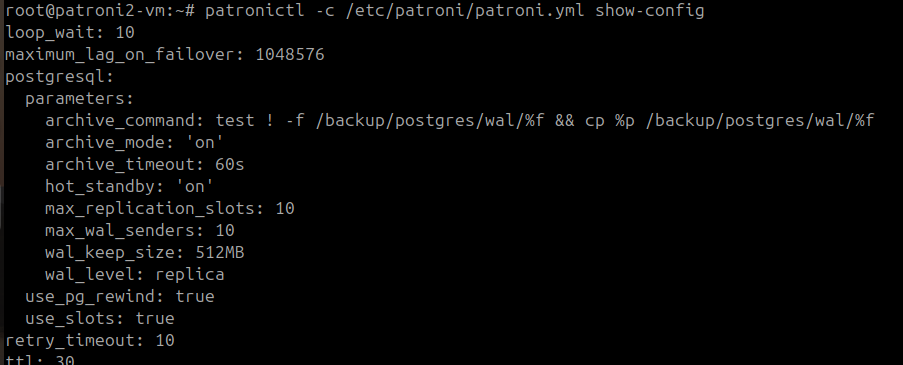
Рисунок 1 - Внесение изменений postgre для бэкапа wal файлов

После чего перезапустила кластер патрони

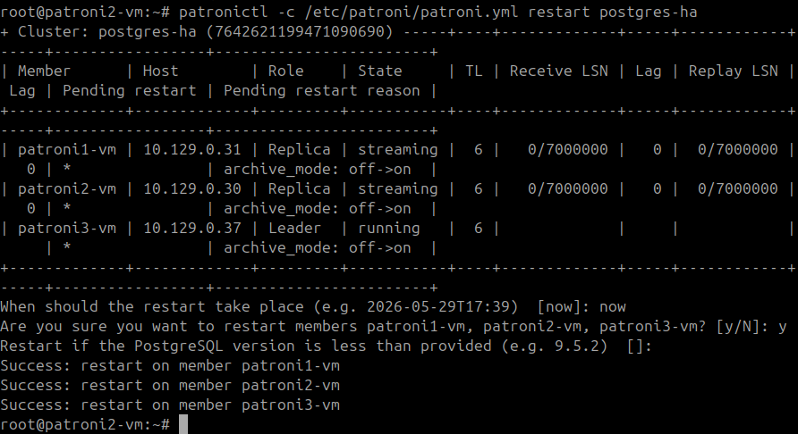
Рисунок 2 - Рестарт патрони кластера

После чего запустила проверку архив мода
SHOW archive_mode;
SHOW archive_command;
SELECT pg_switch_wal();

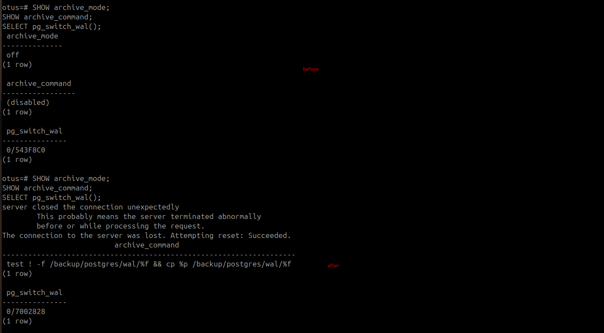
Рисунок 3 - До внесения правок в конфиги патрони и после

Проверяю кто из патрони лидер, а кто реплика, для последующего создания бэкапа.

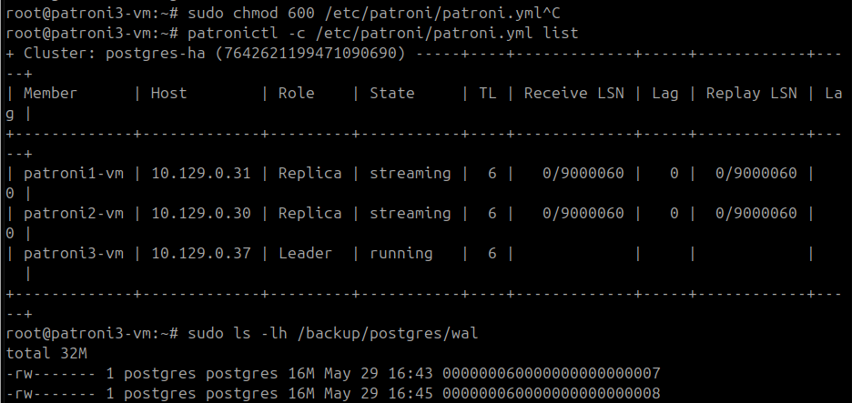
Рисунок 4 - Проверка лидера и реплик кластера патрони

На реплике -patroni-vm 2 запускаю создание бэкапа.
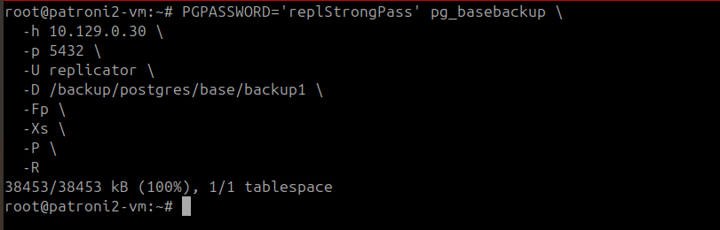

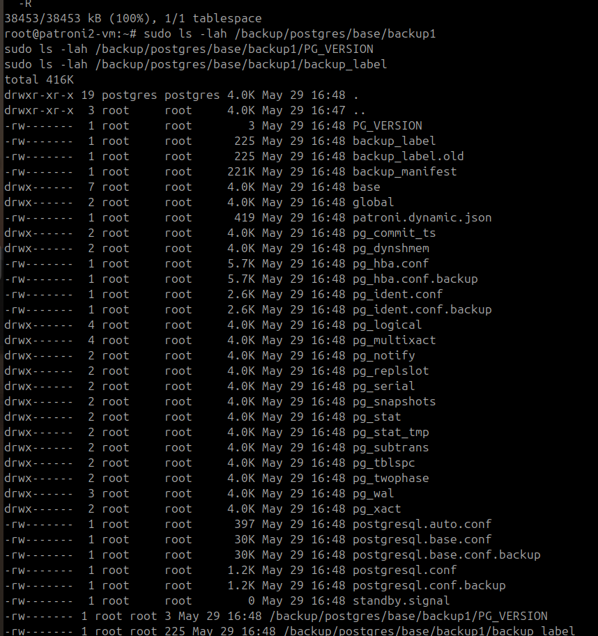
Рисунок 6 - Проверка созданного бэкапа
## Задание 2. 
## Восстановите данные на другом кластере, чтобы убедиться, что бэкапы работают. 
### Ход действий:
Подняла новую виртуальную машину otusrestoretunelab  с private ip 10.129.0.14.
Установила чистый postgre , удалила все системные файлы из дирректории с системными и данными по умолчанию.

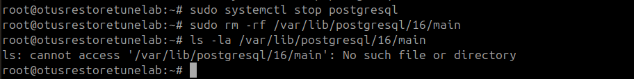
Рисунок 7 - Подготовка чистой postgre аналогичной версии с pg

Скопировала созданный бэкап на новую машинку 
И выполнила следующие команды:

      sudo chown -R postgres:postgres /var/lib/postgresql/16/main
      sudo chmod 700 /var/lib/postgresql/16/main
      sudo mkdir -p /backup/postgres/wal
      sudo chown -R postgres:postgres /backup/postgres
      sudo chmod -R 700 /backup/postgres
А также внесла правки в конфиги для запуска postgrе, в режиме восстановления.

      sudo touch /var/lib/postgresql/16/main/recovery.signal
      sudo chown postgre:postgre /var/lib/postgresql/16/main/recovery.signal
      root@otusrestoretunelab:~#   sudo cat /var/lib/postgresql/16/main/postgresql.auto.conf
      # Do not edit this file manually!
      # It will be overwritten by the ALTER SYSTEM command.
      primary_conninfo = 'user=replicator password=replStrongPass channel_binding=prefer host=10.129.0.30 port=5432 sslmode=prefer sslcompression=0 sslcertmode=allow sslsni=1 ssl_min_protocol_version=TLSv1.2 gssencmode=prefer krbsrvname=postgres gssdelegation=0 target_session_attrs=any load_balance_hosts=disable'
      restore_command = 'cp /backup/postgres/wal/%f %p'
      recovery_target_timeline = 'latest'

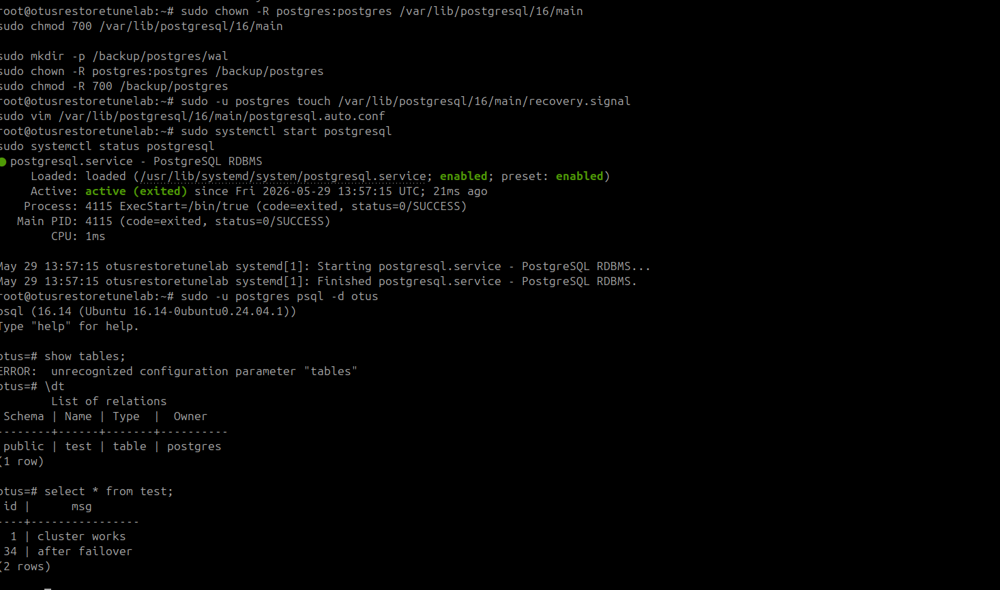
Рисунок 8 - Запуск нового инстанса postgre с восстановленными данными и проверка отображения данных

## Задание 3.
## Проверьте, что данные восстановлены корректно.
### Ход действий:
Убедилась, что таблица test созданная в рамках ДЗ4 создалась и корректно отображается на восстановленной машине.

## Задание 4. Дополнительно: 
## Снимите бэкап под нагрузкой с реплики.
### Ход действий:

С haproxy для имитации нагрузки запустила pgbench, следующей командой:
         
      pgbench -h 127.0.0.1  -p 5000 -U postgres -c 10 -j 2 -T 200 otus

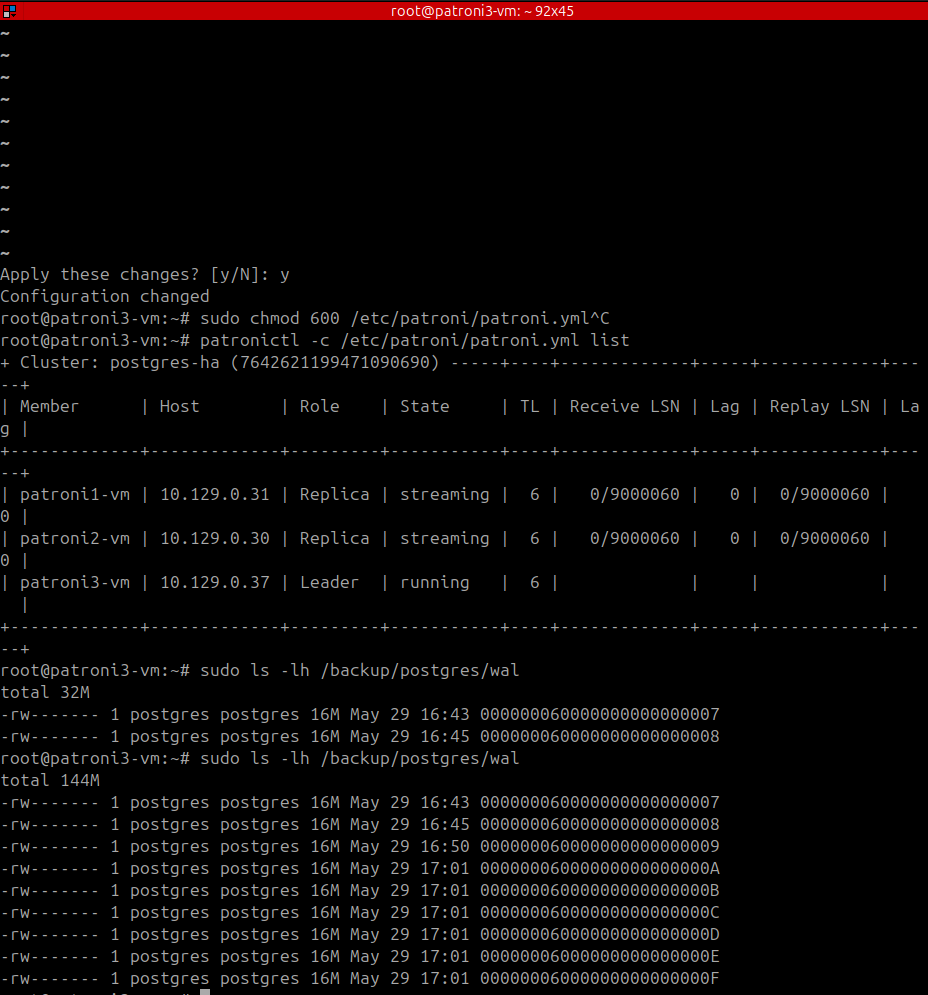
Рисунок 9 -  Проверила более скоростное формирование wal файлов на патрони 

На основании данных полченных с рисунка 9, а именно проверки статуса кто из участников патрони является репликой , а кто лидер, на реплике запустила бэкап

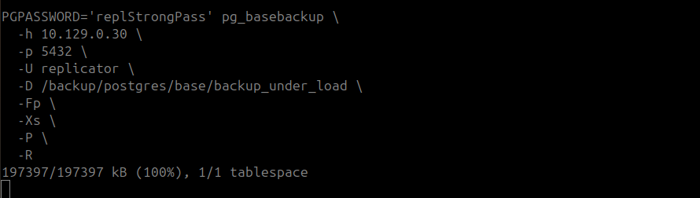
Рисунок 10 - Запуск бэкапа на реплика патрони

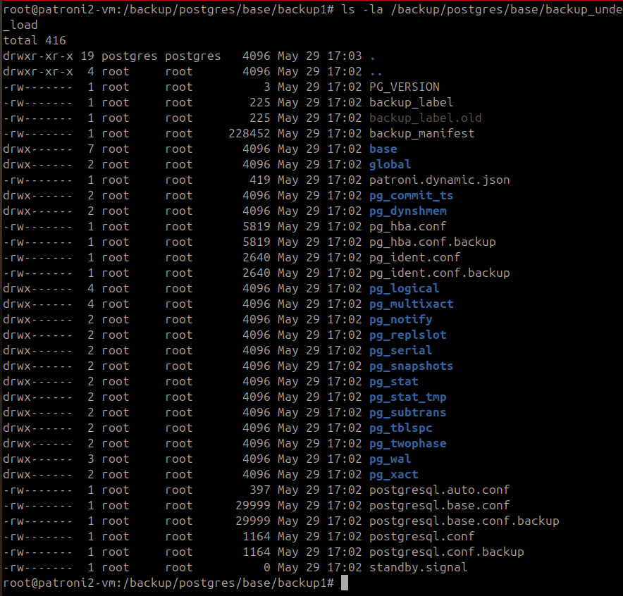
Рисунок 11 - Убедилась, что бэкап под нагрузкой создан

## Вывод о пределанной работе:
Бэкап Postgre был настроен через физический base backup и WAL-архивирование, после чего в рамках теста данные были восстановлены на отдельном Postgre stanby vm.
Дополнительно в рамках изучения был снят backup с реплики во время нагрузки pgbench, что подтвердило возможность безопасного резервного копирования без нагрузки на primary.