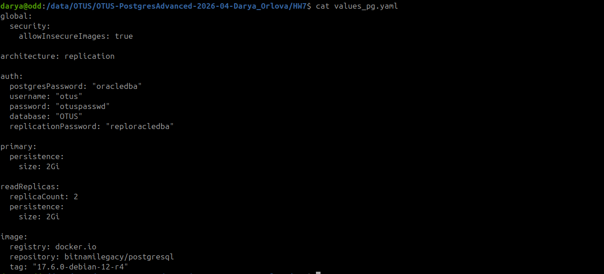
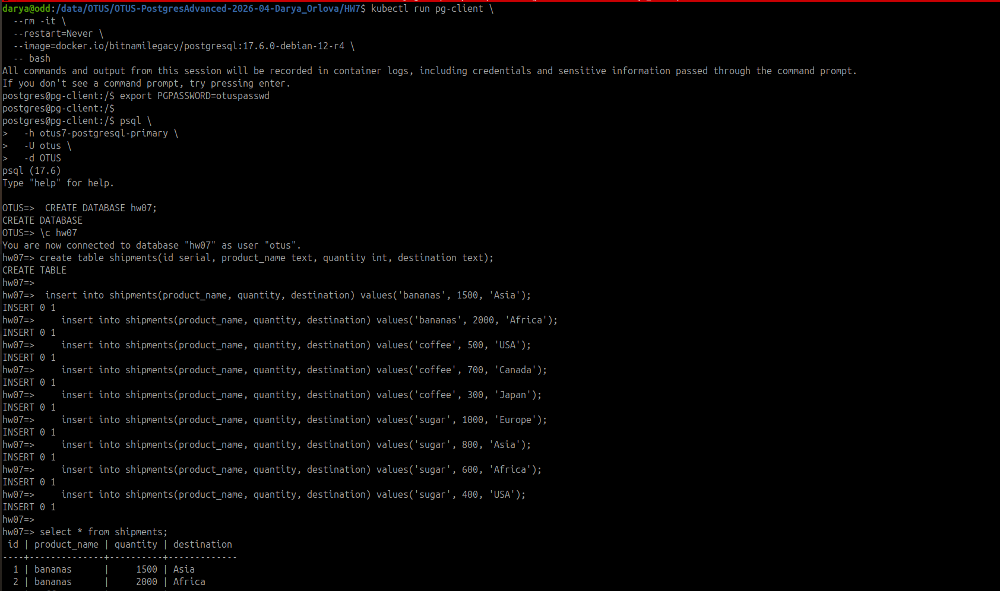

# HW 7 - PostgreSQL в Minikube
## Задание 
## Развернуть PostgreSQL через Helm. Укажите параметры подключения в values.yaml.Обеспечьте масштабируемость: задайте replicaCount: 3 или используйте StatefulSet, если уверены.
### Ход действий:

Так как на моем пк не было установлено minikube я произвела установку следующим образом:

    curl -LO https://storage.googleapis.com/minikube/releases/latest/minikube-linux-amd64
    sudo install minikube-linux-amd64 /usr/local/bin/minikube
Проверила установленную версию миникуба:

    minikube version
    minikube version: v1.38.1

После чего запустила миникуб с 8 гб и 4 цпу. (выделила именно под миникуб) следующей командой:
    
    minikube start  --driver=docker --cpus=4 --memory=8192

Переключилась на нужный для себя контекс для работы через kubectl

    kubectl config use-context minikube
    Switched to context "minikube".
    kubectl config get-contexts
    CURRENT   NAME                                          CLUSTER                         AUTHINFO                                      NAMESPACE
          darya.a-api.k8s-pc-dev.authcommon.com         api.k8s-pc-dev.authcommon.com   darya.a-api.k8s-pc-dev.authcommon.com         
    *         minikube                                      minikube                        minikube                                      default
          teleport-test.authcommon.com-hetz-deckhouse   teleport-test.authcommon.com    teleport-test.authcommon.com-hetz-deckhouse
Проверила ноды для миникуба: 
    
    kubectl get nodes
    NAME       STATUS   ROLES           AGE   VERSION
    minikube   Ready    control-plane   84s   v1.35.1

Установку кластере postgresql выполнила через helm

Рисунок - 1 содержимое файла переменных с описанием поднимаеого кластера

Команда для поднятия релиза в helm

    helm install otus7 oci://registry-1.docker.io/bitnamicharts/postgresql \
      --version 18.7.6 \
      -f values_pg.yaml

Проверяем что все поды и statefulset точно поднялись и в рабочем состоянии:

    kubectl get pods
    NAME                         READY   STATUS    RESTARTS   AGE
    otus7-postgresql-primary-0   1/1     Running   0          58s
    otus7-postgresql-read-0      1/1     Running   0          58s
    otus7-postgresql-read-1      1/1     Running   0          17s

    kubectl get statefulset
    NAME                       READY   AGE
    otus7-postgresql-primary   1/1     79s
    otus7-postgresql-read      2/2     79s

Проверяем подключение и работоспособность нашего нового кластера.
Для этого рядом поднимаем временный под с pg_client и через bash подключаемся к нашему кластеру
Через временный под создаем бд HW07 и в нем таблиц shipment, аналогичную прошлым бд.
Заполняем ее тестовыми данными и проверяем отработку запроса на выборку данных.

Рисунок 2 - Результат отработки запроса

## Вывод: Успешно равзернула Postgre 17.6 через helm release базированный на образе из Helm Chart-а (Bitnami PostgreSQL). В кластере работают 3 поды. Выборки отрабатывают. 
