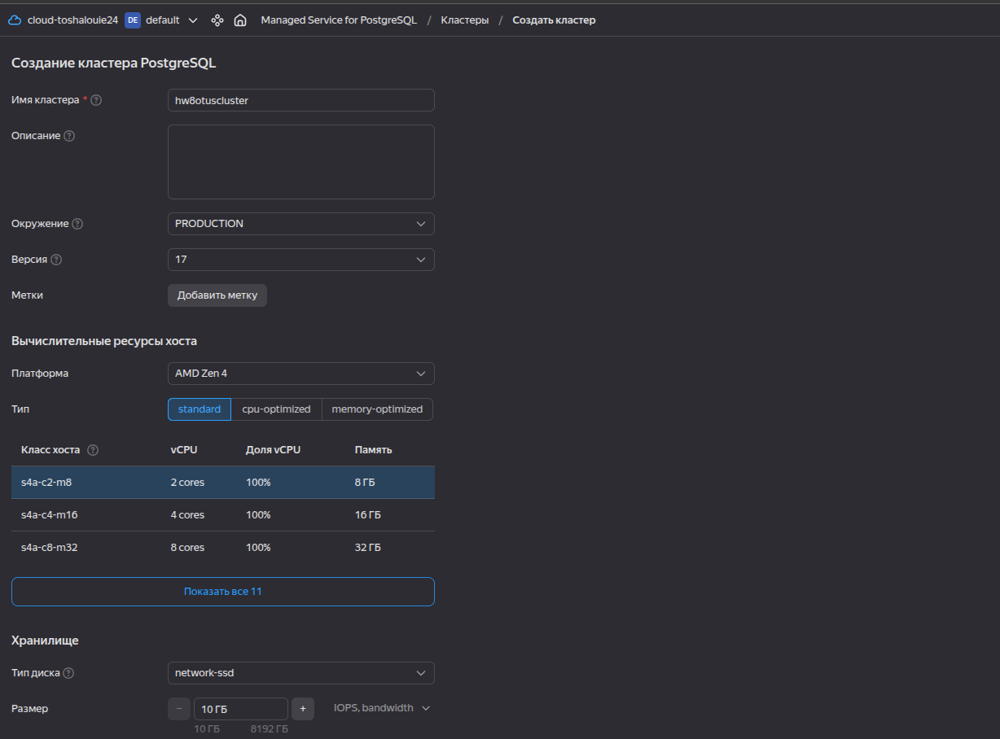
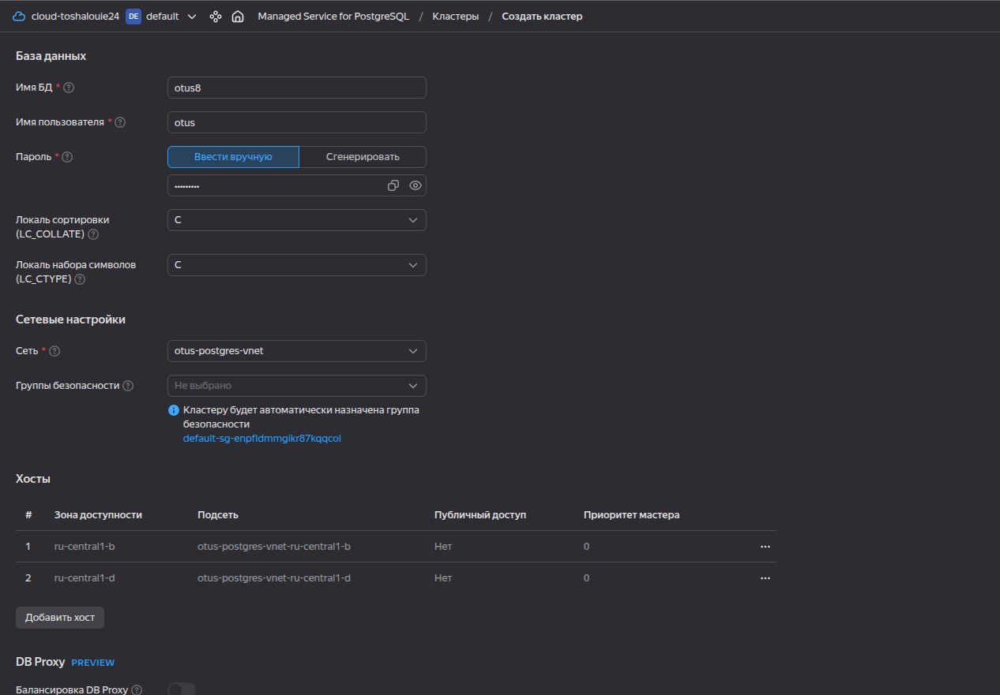
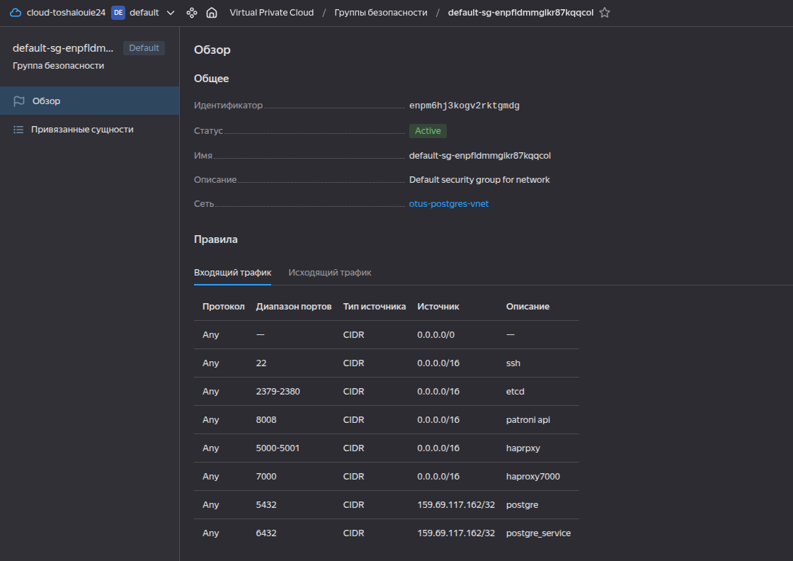
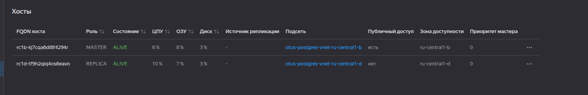

# HW 8 - Managed PostgreSQL в Yandex Cloud
## Задание: Развернуть Managed PostgreSQL в Yandex Cloud

### Ход действий:
Так как при создании PotgreSQL кластера в яндекс я не смогла найти размер меньше 2 цпу и 8 озу, то пришлось создавать кластер с этими параметрами.

Рисунок 1 - Создание кластера

Рисунок 2 - Продолжение создания кластера с указанием сети, названия бд, и пользователя с доступом к этой БД.

Внесла правки в NSG для входа только с моего статичного ип-шника.

Рисунок 3 - Ограничила вход по порту 6432 (postgre) для одного ип-шника

Дополнительно включила Public access. После того как кластер был в состоянии готовом (alive) к подключению выполнила подключение из клиента postgre с локальной машины.

Рисунок 4 - Включение публичного доступа на мастер

Подключение выполняла на мастер.

    psql "host=rc1b-kj7cqa6dl8f4294r.mdb.yandexcloud.net port=6432 sslmode=require dbname=otus8 user=otus target_session_attrs=read-write"
    Password for user otus: 
    psql (16.14 (Ubuntu 16.14-0ubuntu0.24.04.1), server 17.10 (Ubuntu 17.10-201-yandex.60090.7e0ac7b2c9))
    WARNING: psql major version 16, server major version 17.
             Some psql features might not work.
    SSL connection (protocol: TLSv1.3, cipher: TLS_AES_256_GCM_SHA384, compression: off)
    Type "help" for help.
    
    otus8=> select * from shipments;
     id | product_name | quantity | destination 
    ----+--------------+----------+-------------
      1 | bananas      |     1000 | Europe
      2 | bananas      |     1500 | Asia
      3 | bananas      |     2000 | Africa
      4 | coffee       |      500 | USA
      5 | coffee       |      700 | Canada
      6 | coffee       |      300 | Japan
      7 | sugar        |     1000 | Europe
      8 | sugar        |      800 | Asia
      9 | sugar        |      600 | Africa
     10 | sugar        |      400 | USA
    (10 rows)
    
Если я правильно все поняла, то  Managed PostgreSQL Yandex Cloud автоматическое масштабирование по метрикам CPU или RAM нет. По крайней мере в рамках моей подписки.

## Вывод: 
Кластер  PostgreSQL успешно развернут в Yandex Cloud с публичным доступом, подключение через psql и проверена работоспособность с помощью тестовых SQL-запросов.