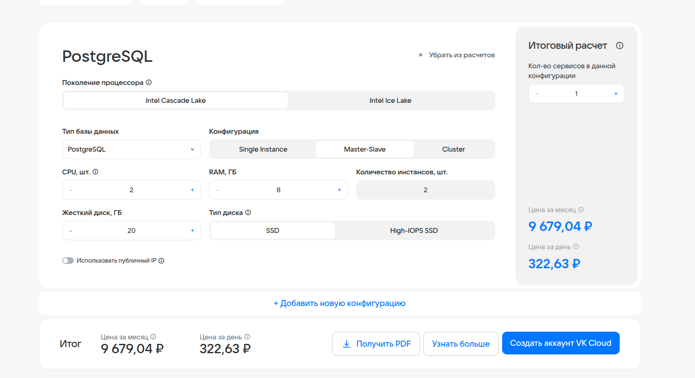
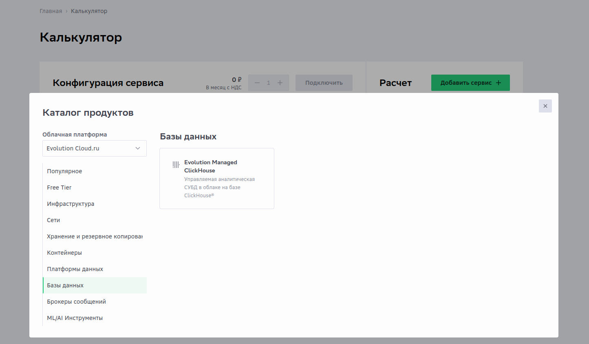
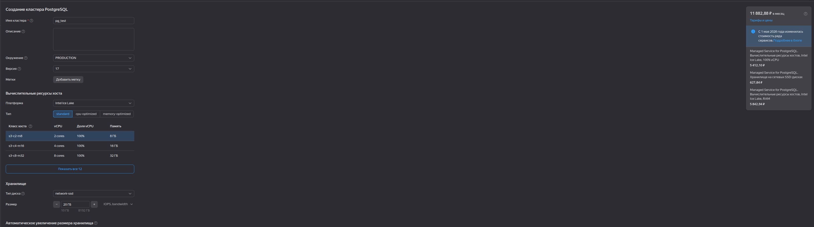

# HW 8 - Managed PostgreSQL и VKcloud
## Задание: Развернуть managed PostgreSQL в двух облаках (на выбор: VK Cloud, Yandex Cloud, SberCloud). 

### Ход действий:
Первоначально за основу сраневния я выбрала yandex, vk cloud и sber cloud. Последний оказался полностью недоступным для регистрации пользователей из РБ. (а номер телефона РФ у меня отсутствует). Поэтому использовала общедоступную информацию.

Рисунок 1 - Стоимость создания сервера с двумя инстансами в vk cloud

По информация из публичного доступа с официальных страниц sber cloud у них нет поддержки rds postgresql. Только clickhouse.

Рисунок 2 - Информация доступная о SberCloud и поддерживаемых БД

Рисунок 3 - Стоимость создания сервера с двумя инстансами в yandex cloud

Исходя из предложенных цен я могу сделать вывод, что яндекс облако предлагает хоть и более дорогой вариант цены для класстера postgresql. VKCloud на 22% процента дешевле, однако yandex по умолчанию гарантирую  репликацию в разные стойки датацентра

## Бонусные баллы:  Полная автоматизация (Terraform + Ansible). 
Мною было принято решение углубиться в основы terraform и закрепить знание ansible.
Для этого я установила terraform cli на свой пк.
Без vpn у меня не получилось скачать готовые apt install terraform так как опять же с наших регионов не доступно.
Поэтому скачала источник https://releases.hashicorp.com/terraform/1.15.8/terraform_1.15.8_darwin_arm64.zip и переместила terafform bin в директорию /usr/local/bin/terraform и выполнила

    sudo mv terraform /usr/local/bin/terraform
    sudo chmod +x /usr/local/bin/terraform

После чего выполнила установку провайдера яндекс. Для это внесла настройки, как это декларирут яндекс для обхода блокировок:

    cat ~/.terraformrc
    provider_installation {
      network_mirror {
        url = "https://terraform-mirror.yandexcloud.net/"
      }
    
      direct {
        exclude = ["registry.terraform.io/*/*"]
      }
    }
Далее выполнила команду для обновления информации о провайдере:

    terraform init -upgrade

Написала [main.tf](otus9-yandex-postgresql/main.tf) и передала туда переменны из [terraform.tfvars](otus9-yandex-postgresql/terraform.tfvars)

После чего выполнила: 
1) Для проверки форматирования:

        terraform fmt 
2) Для валидации файла

        terraform validate

3) Посмотреть что будет выполнено

        terraform plan

4) Только после этого выполнила для применения описанных изменений
        terraform apply

Результат выполнения:

    adminlp@adminlp:/data/otus9-yandex-postgresql$ terraform apply
    data.yandex_vpc_subnet.otus: Reading...
    data.yandex_vpc_network.otus: Reading...
    data.yandex_compute_image.ubuntu_2404: Reading...
    data.yandex_vpc_subnet.otus: Read complete after 0s [id=ajce3ean8fm4n23hrqlc]
    data.yandex_compute_image.ubuntu_2404: Read complete after 0s [id=fd8qp6dt85f1hl8r28r2]
    data.yandex_vpc_network.otus: Read complete after 0s [id=enpfldmmgikr87kqqcol]
    yandex_vpc_security_group.postgres_access: Refreshing state... [id=enp5lkebjq2ds335spdq]
    
    Terraform used the selected providers to generate the following execution plan. Resource actions are indicated with the following symbols:
      + create
    
    Terraform will perform the following actions:
    
      # local_file.ansible_inventory will be created
      + resource "local_file" "ansible_inventory" {
          + content              = (known after apply)
          + content_base64sha256 = (known after apply)
          + content_base64sha512 = (known after apply)
          + content_md5          = (known after apply)
          + content_sha1         = (known after apply)
          + content_sha256       = (known after apply)
          + content_sha512       = (known after apply)
          + directory_permission = "0777"
          + file_permission      = "0777"
          + filename             = "./ansible/inventory.ini"
          + id                   = (known after apply)
        }
    
      # yandex_compute_instance.otus9 will be created
      + resource "yandex_compute_instance" "otus9" {
          + allow_stopping_for_update = true
          + created_at                = (known after apply)
          + folder_id                 = (known after apply)
          + fqdn                      = (known after apply)
          + gpu_cluster_id            = (known after apply)
          + hardware_generation       = (known after apply)
          + hostname                  = "otus9"
          + id                        = (known after apply)
          + maintenance_grace_period  = (known after apply)
          + maintenance_policy        = (known after apply)
          + metadata                  = {
              + "user-data" = <<-EOT
                    #cloud-config
                    users:
                      - name: ubuntu
                        groups: [sudo]
                        shell: /bin/bash
                        sudo: ALL=(ALL) NOPASSWD:ALL
                        ssh_authorized_keys:
                          - ssh-rsa AAAAB3NzaC1yc2EAAAADAQABAAABgQCuDxr+LxrxLoGxFI+L+cmed6U5hUNaZwi1NEfeJ5OdwNn9JH9xJUjRhbLAdhsGCySSf8fapzMfTPsS5Du2DyA2ckqVERUmoL699L0AtBb0lUbKQzDYuiyMj8VBgj1UiiAMFiSi+MTFxdF/sI75BTopqg4CA/piYuL+5qEU+63SADAvkRt/pqSHWfphPfg5ZhMKgBVPhNNi5Z+6IhPZt9Oa6KSLH8TnBtBr6GrWshv2NImutzGJS+oWDQvGKb0sRUw3dLIoHbP0GxHOCHuFqUIQpgs5TSahPr5jIo9OTb6+5v8hD8Xqj6TY7Zc7Wwk0Asb2ExsZQdhq+VgRHfOEIuaIJ3k8Z7FJXanykOy+aV1vqzHs3LAX0p7c4aTTRGMa4Hy1KtnE3B8mLFqs+DIs7qYHVjXQ8sdDxSINyqvvzVsluhVuyZJAISlHl6LslPdNMXf69CKVjKnr33G//nyY8j82oOevC0bXxpwOcVN6oIYoYYY+LyjfiVOUNYi1jPmYXB8= adminpc@adminpc
                    ssh_pwauth: false
                    disable_root: true
                    package_update: true
                    packages:
                      - python3
                      - python3-apt
                EOT
            }
          + name                      = "otus9"
          + network_acceleration_type = "standard"
          + platform_id               = "standard-v3"
          + status                    = (known after apply)
          + zone                      = "ru-central1-e"
    
          + boot_disk {
              + auto_delete = true
              + device_name = (known after apply)
              + disk_id     = (known after apply)
              + mode        = (known after apply)
    
              + initialize_params {
                  + block_size  = (known after apply)
                  + description = (known after apply)
                  + image_id    = "fd8qp6dt85f1hl8r28r2"
                  + name        = (known after apply)
                  + size        = 30
                  + snapshot_id = (known after apply)
                  + type        = "network-ssd"
                }
            }
    
          + metadata_options (known after apply)
    
          + network_interface {
              + index              = (known after apply)
              + ip_address         = (known after apply)
              + ipv4               = true
              + ipv6               = (known after apply)
              + ipv6_address       = (known after apply)
              + mac_address        = (known after apply)
              + nat                = true
              + nat_ip_address     = (known after apply)
              + nat_ip_version     = (known after apply)
              + security_group_ids = [
                  + "enp5lkebjq2ds335spdq",
                  + "enpm6hj3kogv2rktgmdg",
                ]
              + subnet_id          = "ajce3ean8fm4n23hrqlc"
            }
    
          + placement_policy (known after apply)
    
          + resources {
              + core_fraction = 100
              + cores         = 2
              + memory        = 8
            }
    
          + scheduling_policy (known after apply)
        }
    
    Plan: 2 to add, 0 to change, 0 to destroy.
    
    Changes to Outputs:
      + postgres_connection = (known after apply)
        + ssh_command         = (known after apply)
        + vm_private_ip       = (known after apply)
        + vm_public_ip        = (known after apply)
    
    Do you want to perform these actions?
      Terraform will perform the actions described above.
      Only 'yes' will be accepted to approve.
    
      Enter a value: yes
    
    yandex_compute_instance.otus9: Creating...
    yandex_compute_instance.otus9: Still creating... [00m10s elapsed]
    yandex_compute_instance.otus9: Still creating... [00m20s elapsed]
    yandex_compute_instance.otus9: Still creating... [00m30s elapsed]
    yandex_compute_instance.otus9: Still creating... [00m40s elapsed]
    yandex_compute_instance.otus9: Still creating... [00m50s elapsed]
    yandex_compute_instance.otus9: Still creating... [01m00s elapsed]
    yandex_compute_instance.otus9: Creation complete after 1m1s [id=bg0hkontpkvhunp4co1s]
    local_file.ansible_inventory: Creating...
    local_file.ansible_inventory: Creation complete after 0s [id=f3e24921fa9f192eb248be7390b3e0a773f52c2d]
    
    Apply complete! Resources: 2 added, 0 changed, 0 destroyed.                                                                                                                                           
    
    Outputs:                                                                                                                                                                                              
                                                                                                                                                                                                          
    postgres_connection = "psql 'host=93.77.161.22 port=5432 dbname=otus user=otus sslmode=prefer'"                                                                                                       
    ssh_command = "ssh -i /home/adminlp/.ssh/id_rsa ubuntu@93.77.161.22"
    vm_private_ip = "10.131.0.15"
    vm_public_ip = "93.77.161.22"

Установила коллекцию для ansibe postgres, которая в дальнейшем будет использоваться в playbook.

    adminlp@adminlp:/data/otus9-yandex-postgresql$ ansible-galaxy collection install -r ansible/requirements.yml
    Starting galaxy collection install process
    Nothing to do. All requested collections are already installed. If you want to reinstall them, consider using `--force`.

И использовала для запуска плэйбук с установкой posgtgresql сервис + минимальная настройка

ansible-playbook \
  -i ansible/inventory.ini \
  ansible/ [install_pg.yaml](otus9-yandex-postgresql/ansible/install_pg.yaml)
    
        PLAY [Install and configure PostgreSQL on Ubuntu 24.04] **********************************************************************************************************************************************
        
        TASK [Gathering Facts] *******************************************************************************************************************************************************************************
        The authenticity of host '93.77.161.22 (93.77.161.22)' can't be established.
        ED25519 key fingerprint is SHA256:p56KYUjJTCDSUus+Y5Ck1phefDHzdLADsWbleSYLvHw.
        This key is not known by any other names
        Are you sure you want to continue connecting (yes/no/[fingerprint])? yes
        ok: [93.77.161.22]
        
        TASK [Wait for cloud-init to finish] *****************************************************************************************************************************************************************
        ok: [93.77.161.22]
        
        TASK [Update APT cache] ******************************************************************************************************************************************************************************
        ok: [93.77.161.22]
        
        TASK [Install PostgreSQL and Python driver] **********************************************************************************************************************************************************
        changed: [93.77.161.22]
        
        TASK [Ensure PostgreSQL listens on all IPv4 interfaces] **********************************************************************************************************************************************
        changed: [93.77.161.22]
        
        TASK [Set password encryption to SCRAM] **************************************************************************************************************************************************************
        changed: [93.77.161.22]
        
        TASK [Allow remote access to the otus database for the otus user] ************************************************************************************************************************************
        changed: [93.77.161.22]
    
        TASK [Ensure PostgreSQL is running before creating roles] ********************************************************************************************************************************************
        ok: [93.77.161.22]
    
        TASK [Create PostgreSQL user] ************************************************************************************************************************************************************************
        [WARNING]: Using world-readable permissions for temporary files Ansible needs to create when becoming an unprivileged user. This may be insecure. For information on securing this, see
        https://docs.ansible.com/ansible-core/2.17/playbook_guide/playbooks_privilege_escalation.html#risks-of-becoming-an-unprivileged-user
        [WARNING]: Module remote_tmp /var/lib/postgresql/.ansible/tmp did not exist and was created with a mode of 0700, this may cause issues when running as another user. To avoid this, create the
        remote_tmp dir with the correct permissions manually
        changed: [93.77.161.22]
        
        TASK [Create PostgreSQL database] ********************************************************************************************************************************************************************
        changed: [93.77.161.22]
        
        TASK [Flush handlers before validation] **************************************************************************************************************************************************************
        
        TASK [Validate local database login] *****************************************************************************************************************************************************************
        ok: [93.77.161.22]
        
        TASK [Show validation result] ************************************************************************************************************************************************************************
        ok: [93.77.161.22] => {
            "postgres_validation.query_result": [
                {
                    "database_name": "otus",
                    "user_name": "postgres"
                }
            ]
        }
         

Для проверки, что сервис postgresql поднялся зашла по ssh на машину и под пользователем postgresql проверила что бд otus создалась 

    postgres@otus9:/root$ PGPASSWORD='oracledba' psql   -h 93.77.161.22   -U otus   -d otus   -c "SELECT current_user, current_database();"
     current_user | current_database 
    --------------+------------------
     otus         | otus
    (1 row)

Вывод: в рамках домашней работы я смогла сравнить стоимость и преимущества двух облачных провайдеров, а так же натренировать опыт с разворачиванием машин через terraform и закрепила навыки использования коллекции postgres для ansible.
Вывод: в рамках домашней работы я смогла сравнить стоимость и преимущества двух облачных провайдеров, а так же натренировать опыт с разворачиванием машин через terraform и закрепила навыки использования коллекции postgres для ansible.